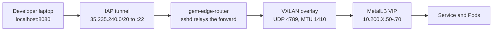

# GEM Edge Router

The GEM Edge Router (`gem-edge-router`) is a small GCE instance that sits on
both the GCP VPC and every GEM cluster's VXLAN overlay. That dual attachment is
what lets a developer's workstation reach MetalLB LoadBalancer VIPs and
secondary-network addresses that are otherwise invisible to GCP routing. The
admin workstation is attached the same way, but the edge router is the host the
tooling targets, and the one you should use.

You reach services on your GEM clusters with
[`scripts/gem-tunnel.sh`](../scripts/gem-tunnel.sh), which opens SSH local port
forwards through the edge router over Identity-Aware Proxy. Anything with an
address on an overlay is reachable, which includes KubeVirt VMs attached to a
secondary network. A workload that only has a pod-network address is not.

## Why this exists

On physical GDC Connected hardware the servers are integrated into the
customer's on-premises network. MetalLB VIPs and Kubernetes Services are
directly routable from a developer's workstation, so browsing to
`http://172.16.12.200` just works.

GEM emulates those L2 segments with VXLAN tunnels over a flat GCP VPC. The
overlay addresses exist only inside the tunnels. GCP's VPC has no route to them
and no way to learn one. The edge router solves this by being dual-attached: it
holds an address on the VPC underlay and an address on every overlay, so a
process running on the edge router can open a TCP connection to any overlay
address. SSH port forwarding turns that local reachability into reachability
from your laptop.

## Architecture

The diagram follows one request from a developer's laptop through to a pod,
naming each hop that makes an unroutable overlay address reachable:



The edge router has exactly one GCE network interface. Everything else is a
virtual `systemd-networkd` VXLAN device layered on top of it:

| Interface                  | Address                                                                   |
| :------------------------- | :------------------------------------------------------------------------ |
| GCE NIC (underlay)         | Ephemeral internal IP in the subnet CIDR, `10.10.0.0/24` by default       |
| `vx-<clusterX>-<vni4>`     | `10.200.<cluster-hash>.254/24`, host octet 254                            |
| `sec-<clusterX>-<vlan_id>` | The secondary network's **gateway** address, for example `172.16.12.1/24` |

Two naming details are important to understand:

- `<clusterX>` is the cluster name with dashes removed, truncated to six
  characters, and `<vni4>` is the first four digits of the VNI. Linux limits
  interface names at 15 characters. The interface name is truncated to fit
  within this limit.
- On a secondary network the edge router takes the network's `gateway` address
  rather than a host address, because it is emulating the top-of-rack switch
  that would be the default gateway on real hardware. Every other host on that
  segment takes `<subnet>.<host_octet>`. The edge router is also the only host
  that uses the subnet's real prefix length; everywhere else it is hardcoded to
  `/24`. That is invisible today because every shipped secondary network is a
  `/24`, but it means a narrower subnet would be misconfigured on the nodes.

### MTU and MSS

GCP caps VPC MTU at 1460 and VXLAN adds 50 bytes of encapsulation overhead, so
every overlay interface is created with an MTU of 1410.

Adjusting the MTU alone is not enough. A per-cluster systemd oneshot service,
`vxlan-tcpmss-<cluster_name>.service`, clamps the TCP Maximum Segment Size (MSS)
on every overlay interface, primary and secondary. Without the MSS clamp, large
TLS payloads are silently dropped and handshakes appear to freeze rather than
fail.

```bash
iptables -t mangle -A POSTROUTING -p tcp --tcp-flags SYN,RST SYN \
  -o <iface> -j TCPMSS --clamp-mss-to-pmtu
```

> [!IMPORTANT]
> This unit is installed by the `vxlan` role, not by the edge-router playbook,
> and it is not restored by the GCS overlay sync described below. Neither is the
> synchronizer itself. A rebuilt edge router therefore comes back with no
> overlay interfaces and no way to fetch them, so run `edge-router.yaml` and
> then `restore-vxlan.yaml` after any rebuild.

The edge router holds no unique state. Every `.netdev` and `.network` file is
mirrored to `gs://gem-${PROJECT_ID}-overlay-sync/edge_router_host/` when the
`vxlan` role runs, and a root cron entry named `GEM VXLAN Overlay Synchronizer`
pulls them back once a minute.

Packages, the `gem` user, the `ip_forward` sysctl, MSS clamping units are not
synced, so rebuilding the VM means re-running both the `edge-router.yaml` and
`restore-vxlan.yaml` Ansible playbooks.

## Installing the edge router

The edge router is technically optional, but incredibly useful. One edge router
instance serves every GEM cluster in the project.

Before you start, the foundation and the admin workstation need to be deployed,
and the workstation's Ansible playbook needs to have run at least once. The
Terraform module reads the `workstation_pubkey` metadata key to authorize SSH,
and that key is published by Ansible rather than by Terraform. If the
workstation VM exists but the playbook has not run, the module silently renders
`ssh-keys = "gem:"` and you get an instance nobody can log into.

You also need the environment variables from the
[README](../README.md#environment-setup) exported, including `PROJECT_ID`,
`TF_STATE_BUCKET`, `GEM_GCP_ZONE` and `PROVISIONING_SA_EMAIL`, and
`project-setup.sh` must have run: it writes the
`terraform/edge-router/terraform.tfvars` that supplies `project_id`, `region`
and `zone`. Those variables have no defaults, so without that file
`terraform apply` stops and prompts for them.

### 1. Provision with Terraform

Point the edge router module at the shared Terraform state bucket and apply it:

```bash
cd terraform/edge-router

terraform init \
  -backend-config="bucket=${TF_STATE_BUCKET}" \
  -backend-config="prefix=edge-router/state" \
  -backend-config="impersonate_service_account=${PROVISIONING_SA_EMAIL}"

terraform apply
```

The edge router instance is an `e2-small` on Ubuntu 24.04 with a 20 GB balanced
boot disk, no external IP, an ephemeral internal IP, and `can_ip_forward`
enabled. OS Login is disabled and the admin workstation's public key is
installed for the `gem` user. Project-level SSH keys are not blocked, which is
what lets `gcloud compute ssh`, and therefore `gem-tunnel.sh`, push your own key
and log in as `gem`.

It runs as the default Compute Engine service account with the `cloud-platform`
scope, which is what lets the overlay synchronizer read the GCS bucket, and it
carries the `http-server` and `https-server` network tags, which is what the
foundation's firewall rules target. Neither is cosmetic: see the warning under
[Files on disk](#files-on-disk).

### 2. Configure with Ansible

Terraform only creates the VM. Ansible does the rest:

```bash
cd ansible
CLUSTER_NAME=none ansible-playbook edge-router.yaml
```

`CLUSTER_NAME` is required because `ansible/inventory.sh` exits without it, not
because it changes what the playbook configures. Any value works, and `none`
simply produces an empty cluster-node group. `PROJECT_ID` is read from the
environment, falling back to your `gcloud` default.

Overlay interfaces are not created here. They are added per cluster by the
`vxlan` role during `create-cluster.yaml`, or restored by `restore-vxlan.yaml`.

## Reaching a service

Run `gem-tunnel.sh` from your local machine. It resolves the target, builds a
`gcloud compute ssh --tunnel-through-iap` invocation with one `-L` forward per
target, and execs it.

```bash
# Forward a MetalLB VIP listening on TCP 7523 to http://localhost:8080
./scripts/gem-tunnel.sh --http 10.200.145.50:7523

# Resolve a Service by namespace/name using your local kubectl
./scripts/gem-tunnel.sh --http default/my-web-service

# Forward RDP and VNC to two different VM IPs at once
./scripts/gem-tunnel.sh --rdp 10.200.145.51 --vnc 10.200.145.52

# Choose the local port explicitly
./scripts/gem-tunnel.sh --http 10.200.145.50:80=8888

# Print the gcloud command instead of running it
./scripts/gem-tunnel.sh --http 10.200.145.50 --print
```

Every forwarding flag is repeatable and takes a spec of the form
`<ip|namespace/service>[:<remote_port>][=<local_port>]`. The flag decides the
default ports:

| Flag       | Default remote port | Local port base | Notes                        |
| :--------- | :------------------ | :-------------- | :--------------------------- |
| `--http`   | 80                  | 8080            |                              |
| `--rdp`    | 3389                | 13389           |                              |
| `--ssh`    | 22                  | 2222            |                              |
| `--vnc`    | 5900                | 15900           |                              |
| `--tunnel` | none                | 9000            | The remote port is mandatory |

Connection details default to your environment: the project from `$PROJECT_ID`
or `gcloud config`, the instance from `$GEM_EDGE_ROUTER_NAME` or
`gem-edge-router`, the zone from `$CLOUDSDK_COMPUTE_ZONE` or `gcloud config`,
and the user `gem`. `--project-id`, `--edge-router`, `--zone` and `--user`
override each of those. Run `gem-tunnel.sh --help` for the full usage.

> [!WARNING]
> When you give `gem-tunnel.sh` a `namespace/service` target it prefers the
> Service's LoadBalancer ingress IP, and falls back to its ClusterIP when there
> is none. ClusterIPs live on a range the edge router has no interface on, so
> the tunnel opens and then refuses to connect. If a Service target does not
> work, check that it is actually a LoadBalancer with a MetalLB address
> assigned.

## Multiple clusters on one edge router

`ansible/inventory.sh` places `edge_router` in the `gdc_nodes` group, so every
`create-cluster.yaml` run adds that cluster's interfaces to the same edge
router. Clusters are separated by VNI and by their `10.200.<hash>.0/24` overlay
subnet.

> [!WARNING]
> Every cluster's `sec-*` interface takes its address from the same global
> `secondary_networks` list, and the edge router always uses the network's
> `gateway` value. Two clusters therefore give the edge router two different
> interfaces configured with the *same* address, for example `172.16.12.1/24` on
> both `sec-alpha1-123` and `sec-bravo2-123`. That is a duplicate address and an
> overlapping route on one host, and it happens no matter what you name your
> clusters. Secondary networks are effectively single-cluster today.

A second, separate problem is that secondary interface names do not include the
VNI. The name is `sec-<clusterX>-<vlan_id>`, so two clusters whose names match
in their first six characters after dashes are removed, such as `gem-cluster-1`
and `gem-cluster-2`, both produce `sec-gemclu-123` for VLAN 123. There is then
only one interface and one pair of files, belonging to whichever cluster ran
last, and the other cluster silently loses that segment. Give clusters names
that differ within the first six characters.

Teardown is affected by the same truncation. `ansible/cleanup.yaml` deletes
objects matching `<clusterX>` from the overlay-sync bucket with a wildcard on
both sides, so tearing down one cluster can remove a sibling's configuration
when the prefixes collide.

> [!NOTE]
> `cleanup.yaml` removes the interfaces, `/etc/systemd/network` files and MSS
> clamping unit from both shared overlay hosts. If you tore a cluster down
> before that was true, the edge router may still be carrying orphaned
> `vx-*`/`sec-*` links and a `vxlan-tcpmss-<cluster>.service` for a cluster that
> no longer exists. Delete those by hand.

Capacity is shared too. A single `e2-small` carries every cluster's overlay
traffic and every developer's SSH tunnels.

## Troubleshooting

### `connect failed: No route to host`

The edge router cannot bridge into the overlay. The usual cause is a rebuilt VM
that came back with a different internal IP. The VXLAN netdev bakes the underlay
source address into `Local=`, so every `.netdev` in GCS still encodes the old IP
after a rebuild, and `systemd-networkd` will not mutate an existing kernel link.

Each `.network` file also carries static `BridgeFDB` entries naming every other
host's underlay IP, so the cluster nodes and the admin workstation are still
pointing at the edge router's dead address. That is why the fix below
re-templates every host rather than just this one, and why the Terraform state
has to hold the new `edge_router_ip` before you run it.

Compare the live IP with what the interface was built with:

```bash
gcloud compute instances describe gem-edge-router \
  --zone="${GEM_GCP_ZONE}" --project="${PROJECT_ID}" \
  --format="value(networkInterfaces[0].networkIP)"
```

Then, on the edge router:

```bash
ip -d link show dev vx-gemclu-1338
```

If the `local` address shown there is not the current internal IP, the kernel is
dropping all encapsulated traffic. Regenerate the mesh from your local machine:

```bash
cd ansible
CLUSTER_NAME=your-cluster-name ansible-playbook restore-vxlan.yaml
```

Then delete the stale links on the edge router so `systemd-networkd` recreates
them:

```bash
sudo ip link delete vx-gemclu-1338
sudo ip link delete sec-gemclu-123
sudo systemctl restart systemd-networkd
```

### Traffic flows one way, or stops after a rebuild

A rebuilt edge router has a new virtual MAC address, but cluster nodes keep
sending replies to the cached one.

```bash
# On a cluster node, look for a STALE entry for 10.200.X.254
ip neigh show dev vxlan0

# Flush it
sudo ip neigh flush dev vxlan0
```

### TLS handshakes hang, large responses stall

MSS clamping is missing. Expect this after a rebuild, because the GCS sync does
not restore the unit.

```bash
systemctl status vxlan-tcpmss-${CLUSTER_NAME}
sudo iptables -t mangle -S POSTROUTING
```

Re-run `restore-vxlan.yaml` to reinstall it.

### Interfaces never appear

Check the synchronizer:

```bash
sudo crontab -l | grep 'GEM VXLAN Overlay Synchronizer'
sudo PROJECT_ID=${PROJECT_ID} HOST_DIR=edge_router_host \
  /usr/local/sbin/gem-cron-overlay-sync.sh
gcloud storage ls gs://gem-${PROJECT_ID}-overlay-sync/edge_router_host/
networkctl status vx-gemclu-1338
```

If the bucket is empty, the `vxlan` role has not run for that cluster yet. Run
`restore-vxlan.yaml`.

### Ansible cannot find the host

`ansible/inventory.sh` exits non-zero without `CLUSTER_NAME`, and without
`PROJECT_ID` unless `gcloud config get-value project` can supply one. It always
emits an `edge_router` group, but the group is empty, and is left out of
`gdc_nodes`, when there is no `edge_router_name` in the Terraform state.

```bash
cd ansible
PROJECT_ID=${PROJECT_ID} CLUSTER_NAME=none ./inventory.sh | jq '.edge_router'
PROJECT_ID=${PROJECT_ID} CLUSTER_NAME=none ./inventory.sh | jq '._meta.hostvars.edge_router_host'
```

If the whole inventory comes back as `{}`, the problem is upstream of the edge
router: the script exits early and emits nothing when it cannot find the admin
workstation in Terraform state.

## Files on disk

| Path                                                 | Purpose                               |
| :--------------------------------------------------- | :------------------------------------ |
| `/etc/systemd/network/10-vx-*.{netdev,network}`      | Primary overlay interface per cluster |
| `/etc/systemd/network/10-sec-*.{netdev,network}`     | Secondary network interface per VLAN  |
| `/etc/systemd/system/vxlan-tcpmss-<cluster>.service` | MSS clamping, per cluster             |
| `/usr/local/sbin/gem-cron-overlay-sync.sh`           | Overlay synchronizer                  |

## Related documentation

- [GEM Networking](gem-networking.md) for the overlay addressing scheme
- [Secondary Networks](secondary-networks.md) for the per-VLAN segments the edge
  router gateways
- [Admin Workstation](admin-workstation.md) for the other shared overlay host
