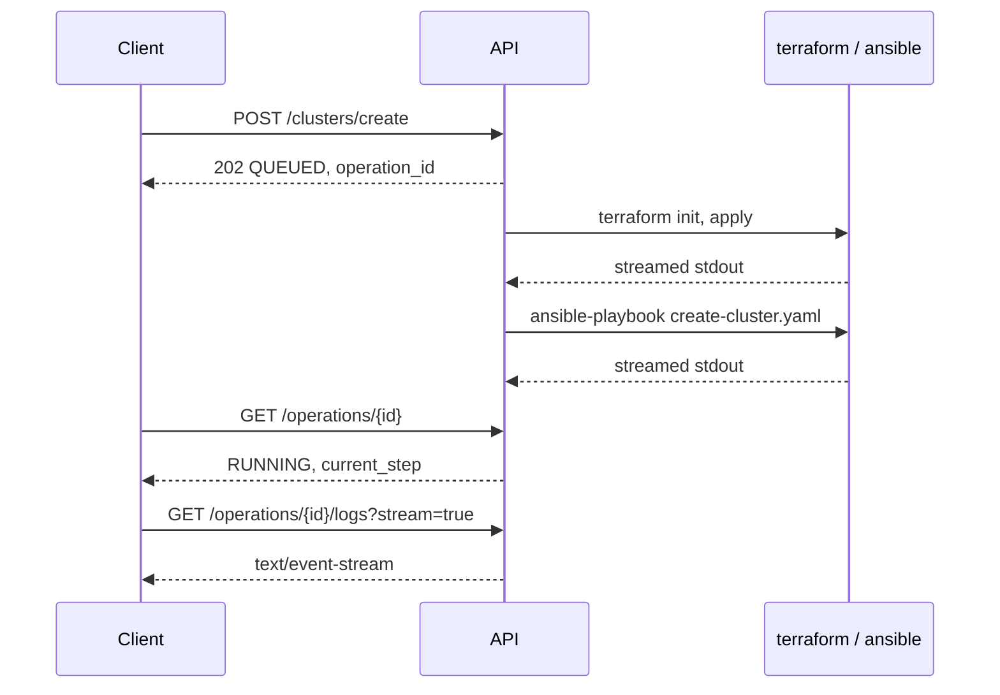

# GEM REST API

Managing GEM clusters manually means running `terraform` and `ansible-playbook`
yourself and monitoring your terminal until they finish. The GEM REST API is a
FastAPI service that manages GEM clusters over HTTP instead. The API shells out
to the same `terraform`, `ansible-playbook`, `gcloud` and `kubectl` binaries you
would run, streams their output, and tracks each run as an operation you can
poll, follow or cancel. It also exposes read and write access to workloads on a
running cluster.

The REST API is one of two orchestration paths. The other is
[Cloud Build](cloud-build.md), which is better suited to unattended and CI
driven builds. The API is better suited to anything interactive, or to be
leveraged by a web application.

The source is in [`api/`](../api).

## Running the API

You need Python 3.13 or later and [uv](https://docs.astral.sh/uv/).

```bash
cd api

# Creates a managed Python virtual environment and installs API dependencies
uv sync

# --reload restarts the server when you edit a source file
uv run uvicorn gem_api.main:app --reload --port 8080

# Validate service health
curl -s localhost:8080/health
# {"status":"ok","app":"GEM REST API","version":"0.1.0"}
```

Once uvicorn is running, open the interactive docs at
http://localhost:8080/docs:

### Exploring without touching real infrastructure

Set `GEM_MOCK_RUNNER` to `true` and the cluster, workstation and edge router
pipelines emit pre-defined log lines instead of running `terraform` and
`ansible-playbook`. Operations, statuses, logs and SSE streams all behave
normally, which makes it a reasonable way to explore the lifecycle endpoints or
develop a client against them.

```bash
GEM_MOCK_RUNNER=true uv run uvicorn gem_api.main:app --port 8080
```

> [!CAUTION]
> Mock mode covers the six lifecycle pipelines and nothing else. The workload
> endpoints still shell out to `kubectl`, and the cluster and project lists
> still shell out to `gcloud`. On a machine with a working kubeconfig,
> `POST /clusters/{name}/vms`, `POST /clusters/{name}/pods`, the power endpoint
> and both `DELETE`s create and destroy real objects on a real cluster while
> mock mode is on.

## API Documentation

FastAPI automatically produces OpenAPI documentation which is available through
the following paths:

| Path            | What it is                                      |
| :-------------- | :---------------------------------------------- |
| `/docs`         | Swagger UI. Interactive, you can call endpoints |
| `/redoc`        | ReDoc. Better for reading                       |
| `/openapi.json` | The raw OpenAPI schema, for generating clients  |

### API Requirements

When not using the mock runner, the REST API needs access to `terraform`,
`ansible-playbook`, `gcloud` and `kubectl` on your `PATH`, a checkout of this
repository at `REPO_ROOT`, and credentials that can impersonate the provisioning
service account. The API runs those binaries as itself, with its own
credentials, so run it where you would run them by hand.

## Running it in a container

Build from the repository root rather than from `api/`. The image needs the API
sources, `api/uv.lock`, and `ansible/group_vars/all.yaml`, none of which are
reachable from an `api/` context:

```bash
# Note the trailing '.': the build context is the repository root
docker build -f api/Dockerfile -t gem-api .

docker run --rm -p 8080:8080 -e GEM_MOCK_RUNNER=true gem-api
```

The image runs as a non-root user and listens on `$PORT`, defaulting to 8080.
The base image, pinned dependency set and environment defaults are all in the
[Dockerfile](../api/Dockerfile). The dependency install is `--frozen`, so a
`uv.lock` that has drifted from `pyproject.toml` fails the build rather than
resolving around it.

> [!IMPORTANT]
> The image deliberately contains none of `terraform`, `ansible-playbook`,
> `gcloud` or `kubectl`, and it copies only `ansible/group_vars/all.yaml` rather
> than the `terraform/` and `ansible/` trees. Lifecycle endpoints still accept a
> request and return `202`, then fail almost immediately with the operation in
> `FAILED`. Workload writes return 503, and the reads return empty results. The
> image is for serving the API surface and for mock mode. Real builds need an
> environment with the full toolchain.

Nothing in this repository deploys the API. There is no Terraform module,
Ansible role or Cloud Build pipeline for it, so running it somewhere shared is
currently a manual exercise. Read [Security](#security) before you do that.

## Common tasks

The examples below assume the service is on http://localhost:8080.

### Build a cluster

`cluster_name` and `zone` are the two you will usually set. Everything else has
a default, and `/docs` lists them:

```bash
curl -s -X POST localhost:8080/api/v1/clusters/create \
  -H 'Content-Type: application/json' \
  -d '{"cluster_name": "gem-cluster-1", "zone": "us-east4-b"}'
```

```json
{
  "operation_id": "gem-cluster-1",
  "status": "QUEUED",
  "message": "Cluster build initiated for 'gem-cluster-1'.",
  "target_resource": "gem-cluster-1"
}
```

The response is `202 Accepted` and returns immediately. The build itself takes
as long as Terraform and `bmctl` take, which is expected to be around 30
minutes.

To override the secondary networks for this cluster, pass a `secondary_networks`
array. Omit the key entirely and the defaults from `ansible/group_vars/all.yaml`
apply. See [Secondary Networks](secondary-networks.md).

### Check on an operation

The REST operation ID is the cluster name:

```bash
curl -s localhost:8080/api/v1/operations/gem-cluster-1
```

```json
{
  "operation_id": "gem-cluster-1",
  "operation_type": "CLUSTER_CREATE",
  "status": "RUNNING",
  "target_resource": "gem-cluster-1",
  "current_step": "Ansible Configuration (2/2)",
  "message": "Ansible task: topolvm : Install TopoLVM via Helm",
  "created_at": "2026-08-21T10:15:00+00:00",
  "updated_at": "2026-08-21T10:28:30+00:00",
  "completed_at": null,
  "error": null
}
```

`current_step` is a high-level progress description, such as
`Terraform Provisioning (1/2)` or `Ansible Configuration (2/2)`. `message` is
finer grained, scraped from the subprocess output: Ansible `TASK [...]` headers,
and Terraform's `Creating...`, `Modifying...` and `Destroying...` lines.

`status` moves through `QUEUED`, `RUNNING`, and then one of `SUCCEEDED`,
`FAILED` or `CANCELLED`. On failure, `error` is populated.

There is no endpoint that lists operations.

### View operation logs

To view operation logs:

```bash
curl -s localhost:8080/api/v1/operations/gem-cluster-1/logs

# Just the last 50 lines
curl -s 'localhost:8080/api/v1/operations/gem-cluster-1/logs?tail=50'
```

To tail logs:

```bash
curl -N 'localhost:8080/api/v1/operations/gem-cluster-1/logs?stream=true'
```

This replays the buffered history first and then closes the stream when the
operation finishes.

Logs are read from `<GEM_LOG_DIR>/<operation_id>.log` when that file exists.

> [!NOTE]
> In streaming mode an unknown operation ID is only detected after the response
> has begun, so you see an aborted stream rather than a clean 404. Check
> `GET /operations/{id}` first if you receive an error when attempting to stream
> logs.

### Cancel a running build

```bash
curl -s -X POST localhost:8080/api/v1/operations/gem-cluster-1/cancel
```

This sends `SIGTERM` to the operation's process group and escalates to `SIGKILL`
after two seconds. Cancelling an operation that has already finished returns 200
with `success: false` and the original status, so it is safe to call
speculatively.

> [!CAUTION]
> Cancelling mid-`apply` leaves partially provisioned infrastructure, and can
> leave the Terraform state lock held. Check with `terraform force-unlock` and
> clean up before you retry.

### Destroy an existing cluster

```bash
curl -s -X POST localhost:8080/api/v1/clusters/delete \
  -H 'Content-Type: application/json' \
  -d '{"cluster_name": "gem-cluster-1"}'
```

This runs `ansible-playbook cleanup.yaml` to reset the cluster with `bmctl` and
unregister it from the fleet, then destroys the VMs with Terraform. It reuses
the cluster name as the operation ID, so poll it exactly as you polled the
build.

### Build the admin workstation and edge router

The admin workstation and the edge router have the same create and delete pair,
and their request bodies are optional. An empty POST uses all defaults:

```bash
curl -s -X POST localhost:8080/api/v1/workstation/create
curl -s -X POST localhost:8080/api/v1/edge-router/create
```

The workstation's operation ID is always `gem-admin-ws` regardless of project or
zone. The edge router's is its instance name.

### Inspect a running cluster

```bash
# Fleet memberships, plus anything holding Terraform state
curl -s localhost:8080/api/v1/clusters

# Node-level status
curl -s localhost:8080/api/v1/clusters/gem-cluster-1/status

# Pods, optionally filtered
curl -s 'localhost:8080/api/v1/clusters/gem-cluster-1/pods?namespace=default'
curl -s 'localhost:8080/api/v1/clusters/gem-cluster-1/pods?label_selector=app%3Dnginx'

# Secondary networks, Config Sync RootSyncs, KubeVirt VMs
curl -s localhost:8080/api/v1/clusters/gem-cluster-1/networks
curl -s localhost:8080/api/v1/clusters/gem-cluster-1/configsync
curl -s localhost:8080/api/v1/clusters/gem-cluster-1/vms
```

`GET /clusters` is the odd one out. It is `gcloud`-backed, and unions the fleet
memberships with a listing of the Terraform state bucket, so it also reports
clusters that were built but never registered with the fleet. The rest shell out
to `kubectl` against a kubeconfig the service discovers on disk, with a six
second timeout per call.

> [!WARNING]
> None of these endpoints report failure. A missing kubeconfig, an unreachable
> cluster, a timed-out call or output that does not parse all produce an empty
> list or `connected: false`, logged at debug level. `/networks` is the trap:
> when the live read fails it falls back to the `secondary_networks` defaults
> from `ansible/group_vars/all.yaml` and returns them as though they were
> present on the cluster. Check the server log before you trust any of these
> responses.

Some of what comes back is not measured. Cluster status reports fixed CPU and
memory figures and derives its totals from the node count, the VM list reports a
fixed size and image for every VM, and pod age is always `10m`. Treat these
endpoints as a convenience for a UI, and use `kubectl` when the numbers matter.

### Run a VM

Unlike the reads above, the workload write endpoints do report failure: 404 when
the object is not found, 409 when it already exists, 503 when `kubectl` is
missing, and 502 for anything else.

```bash
curl -s -X POST localhost:8080/api/v1/clusters/gem-cluster-1/vms \
  -H 'Content-Type: application/json' \
  -d '{
    "name": "ubuntu-edge-01",
    "image": "quay.io/containerdisks/ubuntu:24.04",
    "cpus": 2,
    "memory": "4Gi"
  }'

# Stop it, then start it again
curl -s -X POST localhost:8080/api/v1/clusters/gem-cluster-1/vms/ubuntu-edge-01/power \
  -H 'Content-Type: application/json' -d '{"running": false}'

curl -s -X DELETE localhost:8080/api/v1/clusters/gem-cluster-1/vms/ubuntu-edge-01
```

The pod endpoints are deliberately simple. `POST .../pods` runs the equivalent
of `kubectl run <name> --image=<image> -n <namespace>` and nothing more. To
create a pod with commands, ports, environment variables, or the
`networking.gke.io/interfaces` annotation that
[secondary networks](secondary-networks.md) need, apply a manifest with
`kubectl`.

> [!WARNING]
> The schema promises more than it delivers. `PodCreateRequest` still declares
> `command`, `port`, `env`, `labels`, `annotations` and `raw_manifest`, and
> `VirtualMachineDeployRequest` still declares `image_type`. Every one of them
> is accepted, answered with a `201`, and then discarded. `/docs` describes
> `annotations` as the place to put `networking.gke.io/interfaces`, which does
> nothing. Every workload endpoint also takes a `project_id` query parameter
> that is read and thrown away, so it will not retarget a request at another
> project.

## How operations work

Lifecycle endpoints are asynchronous. A create or delete validates its payload,
registers an operation, schedules an `asyncio` task in the same process, and
returns `202` before any work has happened.



- Operation IDs are resource names, not UUIDs. Convenient, because you can poll
  without storing anything. The cost is that re-running an operation against the
  same resource overwrites the previous record and truncates its log file. There
  is no operation history.

- One active operation per resource. A second create or delete against a
  resource that already has a `QUEUED` or `RUNNING` operation gets
  `409 Conflict`. The guard matches on the operation's target resource, not on
  its ID, so a create and a delete for the same resource conflict with each
  other too.

- State is in memory. Operation records live in a module-level dictionary.
  Restarting the process loses them, although the log files on disk survive and
  stay readable. The service is therefore single-instance only: two replicas
  would each keep their own operation table, so status lookups would land on the
  wrong instance and the conflict guard would not hold.

- A failure after an operation has been accepted (HTTP/202) is not an HTTP
  error. The request to the API was successful, but has failed somewhere
  downstream. A failed pipeline shows up as `status: FAILED` with a populated
  `error` on the operation.

### What each pipeline runs

| Operation          | Commands, in order                                                                  |
| :----------------- | :---------------------------------------------------------------------------------- |
| Cluster create     | `terraform init` and `apply` in `terraform/cluster`, then `create-cluster.yaml`     |
| Cluster delete     | `cleanup.yaml`, then `terraform init` and `destroy`                                 |
| Workstation create | `terraform init` and `apply` in `terraform/admin-workstation`, then the ws playbook |
| Workstation delete | `terraform init` and `destroy`                                                      |
| Edge router create | `terraform init` and `apply` in `terraform/edge-router`, then `edge-router.yaml`    |
| Edge router delete | `terraform init` and `destroy`                                                      |

> [!WARNING]
> The API and the [Cloud Build pipelines](cloud-build.md) use the same Terraform
> state prefix for a cluster. Running both against one cluster contends for a
> single state lock. Pick one orchestration path per cluster.

## Configuration

Most settings are read from an environment variable of the same name,
case-insensitive, or from a `.env` file in the working directory.
`GEM_MOCK_RUNNER` and `GEM_GROUP_VARS_PATH` are the two exceptions. They are
read straight from the process environment, so putting them in `.env` does
nothing.

| Variable               | Default              | Purpose                                                              |
| :--------------------- | :------------------- | :------------------------------------------------------------------- |
| `REPO_ROOT`            | The parent of `api/` | Working directory for Terraform and Ansible                          |
| `GEM_LOG_DIR`          | `/tmp/gem-api/logs`  | Where operation log files are written                                |
| `LOG_DIR`              | unset                | The same thing, and it wins over `GEM_LOG_DIR` if both are set       |
| `MAX_LOG_BUFFER_LINES` | `1000`               | In-memory log buffer per operation, and the most a stream can replay |
| `GEM_MOCK_RUNNER`      | unset                | `true`, `1` or `yes` enables mock mode                               |
| `GEM_GROUP_VARS_PATH`  | unset                | Pins the manifest path instead of searching for it                   |
| `DEFAULT_PROJECT_ID`   | unset                | Sets the project directly, skipping the resolution below             |
| `DEFAULT_ZONE`         | unset                | Sets the zone directly, skipping the resolution below                |

`HOST`, `PORT` and `DEBUG` are only honoured when you run the package directly
with `python -m gem_api.main`, which is what the container does. Under the
`uv run uvicorn` command above, pass `--host`, `--port` and `--reload` instead.
The container also overrides `GEM_LOG_DIR` to `/var/log/gem-api`.

When `GEM_GROUP_VARS_PATH` is unset the service tries
`ansible/group_vars/all.yaml` under `REPO_ROOT`, then
`/app/ansible/group_vars/all.yaml` for the container layout, then a path
relative to the installed package. Setting it makes that path the only
candidate, so a typo produces a hard failure rather than a fallback.

The project, zone and kubeconfig are each resolved by trying a series of sources
in order:

- **Project**: `PROJECT_ID`, `GCP_PROJECT`, `gcloud config get-value project`,
  then `gem-default-project`.
- **Zone**: `GEM_GCP_ZONE`, `CLOUDSDK_COMPUTE_ZONE`,
  `gcloud config get-value compute/zone`, then `us-central1-a`. The region is
  the zone minus its final segment.
- **Kubeconfig**: `$KUBECONFIG`, `~/.kube/<cluster>-kubeconfig`,
  `/tmp/<cluster>-kubeconfig`, `/home/gem/.kube/config`, `~/.kube/config`.

These resolve when the API first starts, `gcloud` lookups happen once at
startup.

## Security

The service performs no authentication and no authorization. There is no API
key, no OIDC verification and no IAM check on any endpoint. CORS is configured
to allow all origins with credentials enabled.

Any client that can reach the port can create and destroy GCP infrastructure
using whatever credentials the process holds, and can read and write workloads
on every cluster it can reach. Bind it to a trusted interface, keep it inside
the VPC or behind IAP, and do not put it on an untrusted network.

## Related documentation

- [Cloud Build](cloud-build.md) for the other orchestration path
- [Project Setup](project-setup.md) for the service accounts the API
  impersonates
- [Secondary Networks](secondary-networks.md) for the `secondary_networks`
  schema
