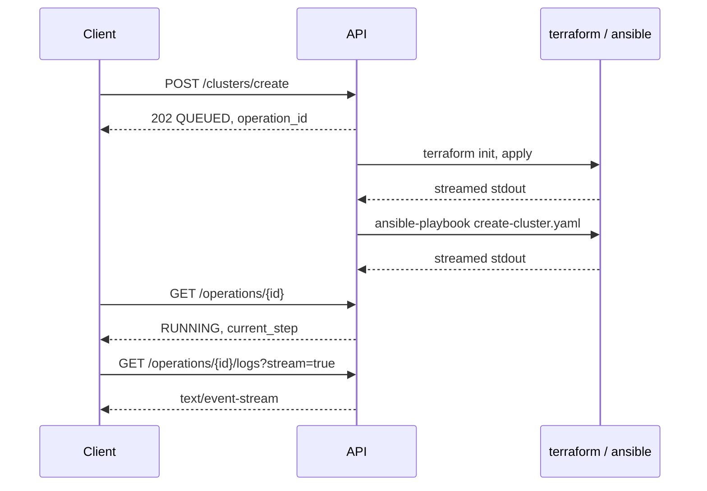

# GEM REST API

Managing GEM clusters from the command line means running `terraform` and
`ansible-playbook` by hand and keeping a terminal open until the build finishes.
The GEM REST API wraps those same `terraform`, `ansible-playbook`, `gcloud`, and
`kubectl` commands in a FastAPI service so you can trigger builds over HTTP,
poll or stream their logs, cancel in-flight runs, and inspect or manage
workloads on a running cluster.

GEM provides two ways to automate cluster builds. [Cloud Build](cloud-build.md)
runs unattended inside GCP and is better suited to CI and shared team builds.
The REST API runs wherever you have the local toolchain installed and is better
suited to interactive workflows or driving GEM from a web UI.

The service source lives in [`api/`](../api).

## Running the API

To run the API against real GCP infrastructure, your machine needs:

- Python 3.13 or later and [`uv`](https://docs.astral.sh/uv/).
- `terraform`, `ansible-playbook`, `gcloud`, and `kubectl` on your `PATH`.
- Credentials that can impersonate the project's provisioning service account,
  as configured by [Project Setup](project-setup.md).

Start the server from the `api/` directory:

```bash
cd api

# Create the virtual environment and install dependencies
uv sync

# Start the server with auto-reload on source changes
uv run uvicorn gem_api.main:app --reload --port 8080

# Verify the service is up
curl -s localhost:8080/health
```

Once the server is running, FastAPI serves interactive documentation and the raw
schema from three paths:

| Path            | Purpose                                                          |
| :-------------- | :--------------------------------------------------------------- |
| `/docs`         | Interactive Swagger UI where you can inspect and call endpoints. |
| `/redoc`        | ReDoc reference view for reading the API schema.                 |
| `/openapi.json` | Raw OpenAPI specification for generating client SDKs.            |

The `/health` response reports the GEM release version the package was built
from, while `/api/v1` is the stable path prefix for clients.

### Mock mode

Set `GEM_MOCK_RUNNER=true` to explore the lifecycle endpoints or develop a
client without provisioning GCP resources. In mock mode, cluster, workstation,
and edge router builds and teardowns emit synthetic log lines instead of running
`terraform` and `ansible-playbook`:

```bash
GEM_MOCK_RUNNER=true uv run uvicorn gem_api.main:app --port 8080
```

> [!CAUTION]
> Mock mode only replaces the six infrastructure create and delete pipelines.
> Cluster and project listings still call `gcloud`, and workload endpoints still
> call `kubectl`. If your machine has a working kubeconfig, calling the pod or
> VM write endpoints in mock mode will create, stop, or delete real resources on
> that cluster.

### Running in a container

If you want to package the API for mock mode or to serve the OpenAPI
documentation, build the image from the repository root so Docker can reach both
`api/` and `ansible/group_vars/all.yaml`:

```bash
# Run from the repository root
docker build -f api/Dockerfile -t gem-api .

# Run the container in mock mode on port 8080
docker run --rm -p 8080:8080 -e GEM_MOCK_RUNNER=true gem-api
```

Base image, dependency flags, and runtime defaults are defined in
[`api/Dockerfile`](../api/Dockerfile). The container image does not bundle
`terraform`, `ansible-playbook`, `gcloud`, or `kubectl`, and it does not copy
the `terraform/` or `ansible/` playbooks, so live builds require running the API
directly on a host with the full toolchain.

## Managing infrastructure

The examples below assume the API is listening on `http://localhost:8080`.

### Build a cluster

Send a `POST` request to `/api/v1/clusters/create`. You normally only need to
pass `cluster_name` and `zone`; all other parameters have defaults documented in
`/docs` and declared in [`clusters.py`](../api/gem_api/models/clusters.py):

```bash
# Start an asynchronous cluster build
curl -s -X POST localhost:8080/api/v1/clusters/create \
  -H 'Content-Type: application/json' \
  -d '{"cluster_name": "gem-cluster-1", "zone": "us-east4-b"}'
```

```json
{
  "operation_id": "gem-cluster-1",
  "status": "QUEUED",
  "message": "Cluster build initiated for 'gem-cluster-1'.",
  "target_resource": "gem-cluster-1"
}
```

The endpoint validates the request, queues the build in the background, and
returns `202 Accepted` immediately. A full cluster build takes roughly 30
minutes. To override the cluster's secondary networks, pass a
`secondary_networks` list in the request body; omitting it uses the defaults in
[`ansible/group_vars/all.yaml`](../ansible/group_vars/all.yaml).

### Track an operation

Every lifecycle operation uses the target resource name as its `operation_id`.
Poll `/api/v1/operations/{operation_id}` to check progress:

```bash
# Check current status and step for gem-cluster-1
curl -s localhost:8080/api/v1/operations/gem-cluster-1
```

```json
{
  "operation_id": "gem-cluster-1",
  "operation_type": "CLUSTER_CREATE",
  "status": "RUNNING",
  "target_resource": "gem-cluster-1",
  "current_step": "Ansible Configuration (2/2)",
  "message": "Ansible task: topolvm : Install TopoLVM via Helm",
  "created_at": "2026-08-21T10:15:00+00:00",
  "updated_at": "2026-08-21T10:28:30+00:00",
  "completed_at": null,
  "error": null
}
```

Fetch or stream the operation's command output from the `/logs` sub-resource:

```bash
# Fetch all buffered log lines
curl -s localhost:8080/api/v1/operations/gem-cluster-1/logs

# Fetch only the last 50 lines
curl -s 'localhost:8080/api/v1/operations/gem-cluster-1/logs?tail=50'

# Stream live output over Server-Sent Events until the operation finishes
curl -N 'localhost:8080/api/v1/operations/gem-cluster-1/logs?stream=true'
```

If an operation ID is unknown and has no log file on disk, both standard and
streaming log requests return `404 Not Found`.

### Cancel an operation

Send a `POST` request to `/api/v1/operations/{operation_id}/cancel` to terminate
a running build or teardown:

```bash
# Cancel the in-flight operation for gem-cluster-1
curl -s -X POST localhost:8080/api/v1/operations/gem-cluster-1/cancel
```

> [!CAUTION]
> Cancelling an operation while `terraform apply` or `terraform destroy` is
> running leaves infrastructure partially provisioned and can leave the GCS
> state lock held. Run `terraform force-unlock` if needed and tear down any
> leftover resources before retrying.

### Destroy a cluster

Send a `POST` request to `/api/v1/clusters/delete` with the cluster name:

```bash
# Tear down gem-cluster-1
curl -s -X POST localhost:8080/api/v1/clusters/delete \
  -H 'Content-Type: application/json' \
  -d '{"cluster_name": "gem-cluster-1"}'
```

Teardown runs `ansible/cleanup.yaml` first to unregister the cluster from the
fleet and remove overlay interfaces from the shared hosts, then runs
`terraform destroy` to delete the cluster VMs and disks. Poll
`/api/v1/operations/gem-cluster-1` to follow the teardown.

### Build the admin workstation and edge router

The admin workstation and edge router expose the same `/create` and `/delete`
pattern. Their request bodies are optional, and an empty `POST` uses your
environment defaults:

```bash
# Provision and configure the shared admin workstation (operation_id: gem-admin-ws)
curl -s -X POST localhost:8080/api/v1/workstation/create

# Provision and configure the shared edge router (operation_id: gem-edge-router)
curl -s -X POST localhost:8080/api/v1/edge-router/create
```

## Inspecting clusters and workloads

Use `GET` requests under `/api/v1/clusters` to list running clusters in the
project and inspect resources on a specific cluster:

```bash
# List currently running GEM clusters registered in GKE Fleet
curl -s localhost:8080/api/v1/clusters

# Check node readiness for a cluster
curl -s localhost:8080/api/v1/clusters/gem-cluster-1/status

# List pods, optionally filtered by namespace or label selector
curl -s 'localhost:8080/api/v1/clusters/gem-cluster-1/pods?namespace=default'
curl -s 'localhost:8080/api/v1/clusters/gem-cluster-1/pods?label_selector=app%3Dnginx'

# List secondary networks, Config Sync RootSyncs, and KubeVirt VMs
curl -s localhost:8080/api/v1/clusters/gem-cluster-1/networks
curl -s localhost:8080/api/v1/clusters/gem-cluster-1/configsync
curl -s localhost:8080/api/v1/clusters/gem-cluster-1/vms
```

`GET /api/v1/clusters` queries GKE Fleet memberships with `gcloud` and returns
clusters whose fleet state is `RUNNING`. The per-cluster endpoints run `kubectl`
against the first matching kubeconfig found on disk.

> [!WARNING]
> The workload read endpoints degrade silently when a cluster is unreachable or
> its kubeconfig is missing: `/status` returns `connected: false`, `/pods`,
> `/vms`, and `/configsync` return empty lists, and `/networks` falls back to
> the default `secondary_networks` list from `ansible/group_vars/all.yaml`.
> Check `/status` first if you need to confirm that the API can reach the
> cluster.

### Manage VMs and pods

You can also create, power-cycle, and delete KubeVirt VMs and Kubernetes pods
through the API. Unlike the read endpoints, workload write endpoints return HTTP
errors when `kubectl` fails (`404 Not Found`, `409 Conflict`,
`503 Service Unavailable` when `kubectl` is missing, and `502 Bad Gateway` for
other command errors):

```bash
# Deploy a containerDisk-backed KubeVirt VM
curl -s -X POST localhost:8080/api/v1/clusters/gem-cluster-1/vms \
  -H 'Content-Type: application/json' \
  -d '{
    "name": "ubuntu-edge-01",
    "image": "quay.io/containerdisks/ubuntu:24.04",
    "cpus": 2,
    "memory": "4Gi"
  }'

# Stop the VM
curl -s -X POST localhost:8080/api/v1/clusters/gem-cluster-1/vms/ubuntu-edge-01/power \
  -H 'Content-Type: application/json' \
  -d '{"running": false}'

# Delete the VM
curl -s -X DELETE localhost:8080/api/v1/clusters/gem-cluster-1/vms/ubuntu-edge-01
```

The pod creation endpoint (`POST /api/v1/clusters/{name}/pods`) runs
`kubectl run <name> --image=<image> -n <namespace>` using only the `name`,
`namespace`, and `image` fields. To deploy pods that require custom commands,
environment variables, or `networking.gke.io/interfaces` annotations for
[secondary networks](secondary-networks.md), apply a manifest directly with
`kubectl`.

## How operations work

Lifecycle endpoints validate the request payload, register an operation record,
spawn an `asyncio` background task in the API process, and return `202 Accepted`
before Terraform or Ansible starts.


```mermaid
sequenceDiagram
    participant C as Client
    participant A as API
    participant T as terraform / ansible
    C->>A: POST /clusters/create
    A-->>C: 202 QUEUED, operation_id
    A->>T: terraform init, apply
    T-->>A: streamed stdout
    A->>T: ansible-playbook create-cluster.yaml
    T-->>A: streamed stdout
    C->>A: GET /operations/{id}
    A-->>C: RUNNING, current_step
    C->>A: GET /operations/{id}/logs?stream=true
    A-->>C: text/event-stream
```

Several design constraints affect how you run and call the service:

- **Operation IDs are resource names.** Using the cluster, workstation, or edge
  router name as the operation ID makes polling predictable, with the trade-off
  that starting a new operation for the same resource overwrites its previous
  in-memory record and log file.
- **Only one operation can run per resource at a time.** Submitting a create or
  delete for a resource that already has a `QUEUED` or `RUNNING` operation
  returns `409 Conflict`.
- **Operation state is in memory.** Active operation records live in process
  memory while logs are written to `GEM_LOG_DIR`. Restarting the server clears
  operation status records (though existing log files remain readable), and the
  service must run as a single instance so requests do not split across separate
  in-memory tables.
- **Downstream failures are reported on the operation.** Once a request returns
  `202 Accepted`, a later Terraform or Ansible error transitions the operation
  to `status: FAILED` and populates its `error` field.
- **Terraform state locks are shared with Cloud Build.** The REST API and the
  [Cloud Build pipelines](cloud-build.md) write to the same GCS state prefix
  (`clusters/<name>/state`), so do not run both against the same cluster at the
  same time.

## Configuration

Runtime settings are defined in [`config.py`](../api/gem_api/config.py) and can
be set via environment variables or a `.env` file in the working directory.

When not explicitly set, the API resolves its target environment and cluster
credentials in the following order:

- **Project**: `PROJECT_ID`, `GCP_PROJECT`, `gcloud config get-value project`,
  and finally `gem-default-project`.
- **Zone**: `GEM_GCP_ZONE`, `CLOUDSDK_COMPUTE_ZONE`,
  `gcloud config get-value compute/zone`, and finally `us-central1-a` (the
  region is derived by dropping the zone suffix).
- **Kubeconfig**: `KUBECONFIG`, `~/.kube/<cluster>-kubeconfig`,
  `/tmp/<cluster>-kubeconfig`, `/home/gem/.kube/config`, and `~/.kube/config`.

Set `REPO_ROOT` if you start the server from outside a repository checkout, and
`GEM_LOG_DIR` (default `/tmp/gem-api/logs`) to change where operation log files
are written.

## Security

The API performs no authentication or authorization and enables CORS for all
origins. Any client that can reach the port can provision or destroy GCP
infrastructure using the server process's credentials and manage workloads on
any cluster whose kubeconfig is on disk. Keep the service bound to `localhost`,
inside the private VPC, or behind Identity-Aware Proxy, and never expose it
directly to an untrusted network.

## Related documentation

- [Cloud Build](cloud-build.md) for the unattended CI orchestration path
- [Project Setup](project-setup.md) for the service accounts the API
  impersonates
- [Secondary Networks](secondary-networks.md) for the `secondary_networks`
  configuration schema
