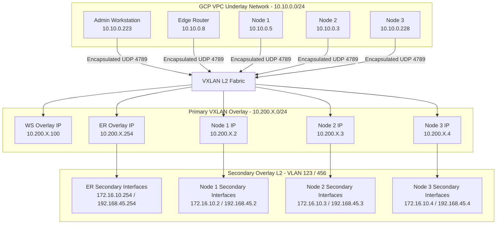
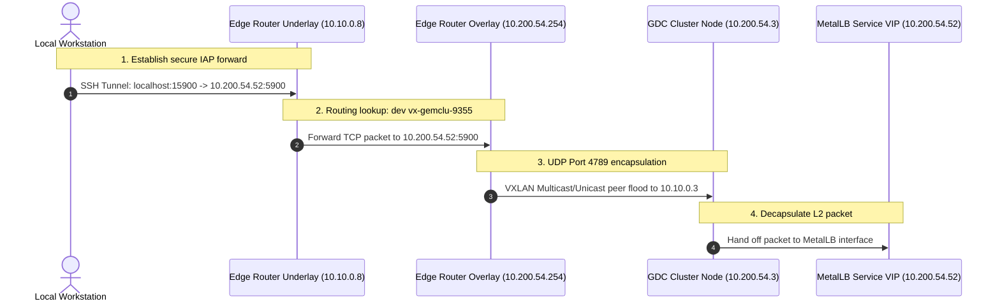

# GEM Networking Design

This document provides a deep-dive engineering reference for the networking architecture, emulation strategies, design decisions, and persistence mechanisms of the GDC EMulation Environment (GEM).

## Networking Overview

GEM emulates a physical, multi-node Google Distributed Cloud (GDC) Connected cluster entirely within Google Compute Engine (GCE) instances. In a physical GDC Connected environment, nodes participate in physical Layer 2 (L2) secondary networks (Multus VLANs) for VM and workload connectivity.

GCP VPC networks are strictly Layer 3 (L3) and do not natively support L2 broadcast, multicast, or custom tagging. GEM solves this by running an Island-Mode VXLAN Overlay Fabric on top of the GCP VPC L3 underlay. This emulates an isolated, virtual L2 network mesh across all GEM nodes, Admin Workstations, and Edge Routers.

## Network Topology

The GEM networking architecture consists of three distinct logical layers:
1.  **GCP VPC Underlay**: The physical routing layer managed by GCP.
2.  **VXLAN Overlay Fabric (Primary Network)**: The virtual L2 control plane mesh where cluster nodes communicate and advertise MetalLB service VIPs.
3.  **Multus Secondary Networks (Secondary Overlay)**: Virtual L2 networks (VLANs) where workload pods and VMRuntime virtual machines bind secondary interfaces. Provisioning of these networks (VLANs, IPAM, MetalLB pools) and their Gateway API integration is managed at the Kubernetes level by `gem-network-operator`; see [docs/secondary-networks.md](secondary-networks.md) and [docs/gem-network-operator-implementation.md](gem-network-operator-implementation.md) for the full design and implementation detail.

### Overall Network Architecture




## The GCP VPC Underlay

The core GCP network layer is provisioned by `terraform/foundation`.
*   **VPC Name**: `gem-clusters-vpc`
*   **Subnet Range**: `10.10.0.0/24` (e.g., `gem-clusters-subnet` in `us-central1`)
*   **NAT Gateway**: A Cloud NAT is deployed to provide egress internet access for packages and dependencies without assigning public IP addresses to cluster nodes.
*   **Dynamic Routing & GCP Firewalls**: Allows all internal communication (`icmp,udp,tcp`) within the private `10.10.0.0/24` subnet. UDP Port **`4789`** is kept open globally inside the VPC to allow VXLAN transport.


## VXLAN Overlay Fabric

A VXLAN overlay is created dynamically via `systemd-networkd` configurations (`.netdev` and `.network` profiles) on the Admin Workstation, Edge Router, and cluster nodes.

### Deterministic Hashing for VNI & IPAM Isolation

To allow for multiple isolated GEM clusters within the same GCP project and sharing the same VPC private subnets (`10.10.0.0/24`), GEM implements a deterministic IPAM and VNI allocation scheme.

Rather than relying on an external database or a centralized state, the dynamic inventory script ([ansible/inventory.sh](../ansible/inventory.sh)) calculates unique, isolated overlay parameters directly from the user-supplied `CLUSTER_NAME`.

#### 1. The CRC32 Hash Seed
First, the cluster name is passed to `cksum`. This produces a highly distributed 32-bit unsigned integer representation of the cluster name:

```math
\text{Hash} = (\text{CRC32}(\text{CLUSTER\_NAME})
```

<br>

In bash, this is extracted using:
```bash
HASH=$(echo -n "$CLUSTER_NAME" | cksum | awk '{print $1}')
```

#### 2. VXLAN VNI Calculation ($VNI$ or $VXLAN\_ID$)
The valid range for a VXLAN Network Identifier (VNI) is a 24-bit space (1 to 16,777,215). GEM maps the `HASH` value into a safe sub-range starting at `100` and capping at `16,000,100`. This avoids system-reserved or low-value ranges while keeping the identifier safely within the 24-bit boundary:

```math
\text{VNI} = (\text{Hash} \pmod{16,000,000}) + 100
```

<br>

```bash
VXLAN_ID=$(( HASH % 16000000 + 100 ))
```
This unique `VXLAN_ID` serves two critical purposes:
*   It acts as the core VNI identifier in the encapsulation header of all L2 UDP VXLAN traffic on the underlay.
*   It is used as part of the virtual interface names on the Admin Workstation and Edge Router (e.g., `vx-gemclu-13383211` or similar truncated variants) to prevent kernel naming collisions.

#### 3. Third Octet IPAM Calculation ($\text{Octet}_{3}$)
To create a fully isolated private IP network for the cluster's primary overlay, GEM reserves the `10.200.X.0/24` private IP space. The third octet ($X$ or $\text{Octet}_{3}$) is calculated by applying a modulo 254 operation, ensuring the value stays in the safe IP range of 1 to 254 (avoiding network address 0 and broadcast address 255):

```math
\text{Octet}_{3} = (\text{Hash} \pmod{254}) + 1
```
<br>

```bash
OCTET3=$(( HASH % 254 + 1 ))
```
The base overlay network is then established as:

```math
\text{Overlay Network} = 10.200.\text{Octet}_{3}.0/24
```

<br>

#### 4. Host IP Assignments within the Overlay Subnet
Once the overlay base network is established, host IPs are assigned deterministically based on their logical function or node index using fixed host octets:

| Host Role | Octet Pattern | Example IP |
| :--- | :--- | :--- |
| GDC Cluster Node 1 | `.2` | `10.200.8.2` |
| GDC Cluster Node 2 | `.3` | `10.200.8.3` |
| GDC Cluster Node 3 | `.4` | `10.200.8.4` |
| Admin Workstation | `.100` | `10.200.8.100` |
| Edge Router | `.254` | `10.200.8.254` |


### 2. Naming Conventions
To ensure physical parity, interface names are strictly mapped:
*   **Emulated Nodes**: Node interfaces are named **`vxlan0`** and **`gdcenet0.<vlan_id>`**. This matches the naming pattern of physical GDC nodes, allowing unmodified GDC `Network` Custom Resources (CRs) utilizing `nodeInterfaceMatcher: interfaceName` to seamlessly discover and bind to them.
*   **Shared Infrastructure (Workstation / Edge Router)**: Tunnels on shared nodes must participate in multiple clusters. They are named uniquely using the first 6 letters of the cluster name and the sliced VNI:
    - Primary VXLAN: `vx-<truncated_cluster>-<short_vni>` (e.g., `vx-gemclu-9355`)
    - Secondary Multus Interfaces: `sec-<truncated_cluster>-<vlan_id>` (e.g., `sec-gemclu-123`)

### 3. MTU Constraints & TCP MSS Clamping
Because GCP VPC enforces an MTU limit of 1460 bytes and VXLAN encapsulation adds 50 bytes of outer header overhead, the virtual VXLAN interface must use an MTU of `1410`.

If a workload sends a packet larger than `1410` with the Don't Fragment (DF) flag set, the packet is silently dropped, resulting in mysterious TLS handshake freezes. GEM solves this by configuring a systemd service (`vxlan-tcpmss-<cluster>.service`) on all hosts which clamps the TCP Maximum Segment Size (MSS):
```bash
iptables -A FORWARD -p tcp --tcp-flags SYN,RST SYN -j TCPMSS --clamp-mss-to-pmtu
iptables -t mangle -A POSTROUTING -p tcp --tcp-flags SYN,RST SYN -o vx-+ -j TCPMSS --set-mss 1370
```


## Ingress Routing (The Edge Router)

The **GEM Edge Router** sits on both the GCP VPC underlay (`ens4`) and the virtual VXLAN overlay networks (`vx-*`, `sec-*`).



1.  **Traefik Reverse Proxy**: Traefik runs as a systemd service on the Edge Router, dynamically reading Kubernetes Service endpoints.
2.  **Island-Mode Bridging**: Traefik accepts incoming SSH IAP tunnel connections from your local machine and directly forwards the packets down the correct local dynamic VXLAN interface.
3.  **IP Forwarding**: IP forwarding is globally enabled (`net.ipv4.ip_forward = 1`) on the Edge Router, letting it act as an L3 router between separate VLAN overlays if required.
