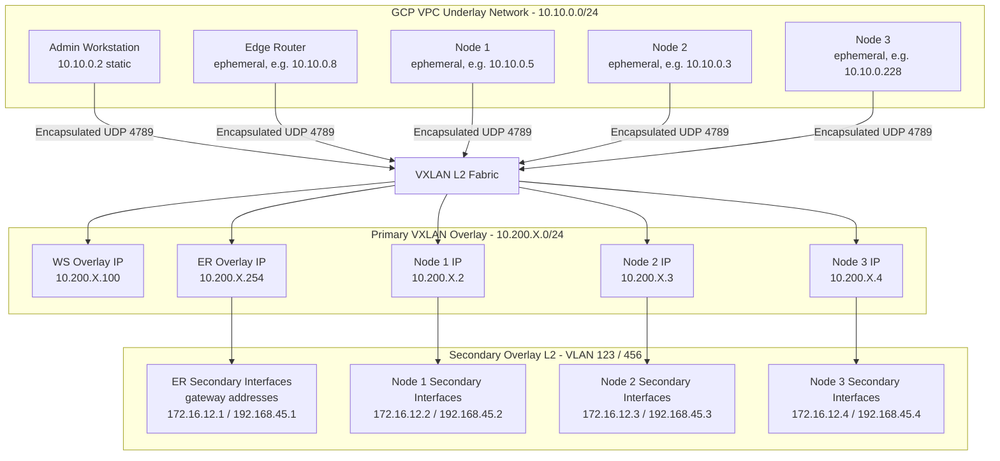
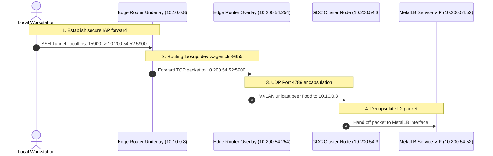

# GEM Networking Design

GEM emulates a physical, multi-node Google Distributed Cloud (GDC) Connected
cluster inside Google Compute Engine (GCE) instances. On physical hardware, GDC
Connected nodes attach to Layer 2 (L2) VLAN trunks for control-plane VIPs and
secondary workload networks.

GCP VPC networks are strictly Layer 3 (L3) and do not support L2 broadcast,
multicast, or 802.1Q VLAN tagging. GEM bridges that gap by running an
island-mode VXLAN overlay fabric on top of the GCP VPC underlay, creating
isolated virtual L2 networks across cluster nodes, the Admin Workstation, and
the Edge Router.

## Network Topology

Three layers stack on top of each other:

1. **GCP VPC Underlay**: The L3 routing layer managed by GCP (`10.10.0.0/24`),
   which carries encapsulated VXLAN traffic on UDP port `4789`.
2. **Primary VXLAN Overlay**: The virtual L2 mesh (`10.200.X.0/24`) where
   cluster nodes communicate and advertise MetalLB service VIPs.
3. **Secondary VXLAN Overlays**: Additional virtual L2 networks that emulate
   VLAN-tagged trunks for workload pods and VMRuntime virtual machines.
   [`gem-network-operator`](secondary-networks.md) reconciles GDC `Network` and
   Gateway API resources against these interfaces; see
   [Secondary Networks](secondary-networks.md) for the Kubernetes control plane
   and pod IPAM design.


```mermaid
graph TB
    subgraph GCP VPC Underlay [GCP VPC Underlay Network - 10.10.0.0/24]
        WS[Admin Workstation<br>10.10.0.2 static]
        ER[Edge Router<br>ephemeral, e.g. 10.10.0.8]
        N1[Node 1<br>ephemeral, e.g. 10.10.0.5]
        N2[Node 2<br>ephemeral, e.g. 10.10.0.3]
        N3[Node 3<br>ephemeral, e.g. 10.10.0.228]
    end

    subgraph VXLAN Overlay [Primary VXLAN Overlay - 10.200.X.0/24]
        direction LR
        WS_OV[WS Overlay IP<br>10.200.X.100]
        ER_OV[ER Overlay IP<br>10.200.X.254]
        N1_OV[Node 1 IP<br>10.200.X.2]
        N2_OV[Node 2 IP<br>10.200.X.3]
        N3_OV[Node 3 IP<br>10.200.X.4]
    end

    subgraph Multus Secondary [Secondary Overlay L2 - VLAN 123 / 456]
        ER_VLAN[ER Secondary Interfaces<br>gateway addresses<br>172.16.12.1 / 192.168.45.1]
        N1_VLAN[Node 1 Secondary Interfaces<br>172.16.12.2 / 192.168.45.2]
        N2_VLAN[Node 2 Secondary Interfaces<br>172.16.12.3 / 192.168.45.3]
        N3_VLAN[Node 3 Secondary Interfaces<br>172.16.12.4 / 192.168.45.4]
    end

    WS -- "Encapsulated UDP 4789" --> VX[VXLAN L2 Fabric]
    ER -- "Encapsulated UDP 4789" --> VX
    N1 -- "Encapsulated UDP 4789" --> VX
    N2 -- "Encapsulated UDP 4789" --> VX
    N3 -- "Encapsulated UDP 4789" --> VX

    VX --> WS_OV
    VX --> ER_OV
    VX --> N1_OV
    VX --> N2_OV
    VX --> N3_OV

    ER_OV --> ER_VLAN
    N1_OV --> N1_VLAN
    N2_OV --> N2_VLAN
    N3_OV --> N3_VLAN
```

## The GCP VPC Underlay

The [`terraform/foundation`](../terraform/foundation) module provisions the
shared GCP network resources:

- **VPC network**: `gem-clusters-vpc` is a custom-mode VPC with automatic subnet
  creation disabled.
- **Subnet**: `gem-clusters-subnet` allocates `10.10.0.0/24` in the configured
  GCP region for the Admin Workstation, the Edge Router, and all cluster nodes.
- **Cloud NAT**: `gem-clusters-vpc-nat` and `gem-clusters-vpc-router` provide
  outbound internet access for package and image downloads without assigning
  external IP addresses to any VM.
- **Firewall rules**: `gem-clusters-allow-internal` allows all `tcp`, `udp`, and
  `icmp` traffic inside `10.10.0.0/24` (including VXLAN over UDP port `4789`),
  and `gem-clusters-allow-iap-ssh` allows TCP port `22` from the IAP forwarding
  range (`35.235.240.0/20`).

## VXLAN Overlay Fabric

The [`vxlan`](../ansible/roles/vxlan) Ansible role configures the overlay via
`systemd-networkd` `.netdev` and `.network` units on the Admin Workstation, the
Edge Router, and every cluster node.

### Deterministic Hashing for VNI and IPAM Isolation

Multiple GEM clusters can coexist in the same GCP project and share the
`10.10.0.0/24` underlay subnet. Rather than tracking allocations in an external
database, [`ansible/inventory.sh`](../ansible/inventory.sh) derives each
cluster's VXLAN Network Identifier (VNI) and overlay subnet deterministically
from `CLUSTER_NAME`:

```bash
HASH=$(echo -n "$CLUSTER_NAME" | cksum | awk '{print $1}')
VXLAN_ID=$(( HASH % 16000000 + 100 ))
OCTET3=$(( HASH % 254 + 1 ))
```

1. **CRC32 seed (`HASH`)**: `cksum` hashes `CLUSTER_NAME` into a 32-bit unsigned
   integer.
2. **Primary VNI (`VXLAN_ID`)**: Reducing `HASH` modulo `16,000,000` and adding
   `100` maps the VNI into the 24-bit VXLAN identifier space (`100` to
   `16,000,099`) while avoiding low system-reserved numbers. Each secondary
   network in `secondary_networks` increments from this base VNI
   (`vxlan_id + loop.index`).
3. **Overlay `/24` subnet (`OCTET3`)**: Reducing `HASH` modulo `254` and adding
   `1` selects a third octet between `1` and `254`, placing the cluster's
   primary overlay at `10.200.<OCTET3>.0/24`.

Within `10.200.<OCTET3>.0/24`, [`ansible/inventory.sh`](../ansible/inventory.sh)
assigns each host a fixed fourth octet (`host_octet`):

| Host Role          | Octet Pattern | Example IP     |
| :----------------- | :------------ | :------------- |
| GDC Cluster Node 1 | `.2`          | `10.200.8.2`   |
| GDC Cluster Node 2 | `.3`          | `10.200.8.3`   |
| GDC Cluster Node 3 | `.4`          | `10.200.8.4`   |
| Admin Workstation  | `.100`        | `10.200.8.100` |
| Edge Router        | `.254`        | `10.200.8.254` |

### Interface Naming Conventions

Interface names differ between dedicated cluster nodes and shared hosts:

- **Cluster nodes**: Every node names its primary overlay interface `vxlan0` and
  its secondary overlay interfaces `gdcenet0.<vlan_id>`. This matches physical
  GDC Connected hosts, so unmodified GDC `Network` manifests using
  `nodeInterfaceMatcher: interfaceName` discover the interfaces without changes.
- **Admin Workstation and Edge Router**: Because the shared hosts attach to
  every active cluster at once, their interface names include the first six
  alphanumeric characters of the cluster name:
  `vx-<truncated_cluster>-<short_vni>` for the primary overlay (using the first
  four digits of `VXLAN_ID`, such as `vx-gemclu-9355`) and
  `sec-<truncated_cluster>-<vlan_id>` for each secondary overlay (such as
  `sec-gemclu-123`).

### MTU Constraints and TCP MSS Clamping

Because GCP VPC enforces an MTU limit of 1460 bytes and VXLAN encapsulation adds
50 bytes of outer header overhead, every overlay interface must use an MTU of
`1410`.

If a workload sends a packet larger than `1410` bytes with the Don't Fragment
(DF) flag set, the underlay drops the packet and TLS handshakes or large payload
transfers stall. To prevent this, the `vxlan` role installs a systemd unit
(`vxlan-tcpmss-<cluster>.service`) on every host that clamps the TCP Maximum
Segment Size (MSS) to the path MTU:

```bash
iptables -t mangle -A POSTROUTING -p tcp --tcp-flags SYN,RST SYN \
  -o <iface> -j TCPMSS --clamp-mss-to-pmtu
```

The service adds one rule per overlay interface on the host (`vxlan0` and each
`gdcenet0.<vlan_id>` on cluster nodes; the cluster's `vx-*` and `sec-*`
interfaces on the Admin Workstation and Edge Router).

## Ingress Routing (The Edge Router)

The [Edge Router](edge-router.md) attaches to both the GCP VPC underlay and each
cluster's `vx-*` and `sec-*` overlay interfaces, acting as an SSH jump gateway
into the private overlays.


```mermaid
sequenceDiagram
    autonumber
    actor Dev as Local Workstation
    participant ER_VPC as Edge Router Underlay (10.10.0.8)
    participant ER_VX as Edge Router Overlay (10.200.54.254)
    participant Node as GDC Cluster Node (10.200.54.3)
    participant VIP as MetalLB Service VIP (10.200.54.52)

    Note over Dev, ER_VPC: 1. Establish secure IAP forward
    Dev->>ER_VPC: SSH Tunnel: localhost:15900 -> 10.200.54.52:5900
    Note over ER_VPC, ER_VX: 2. Routing lookup: dev vx-gemclu-9355
    ER_VPC->>ER_VX: Forward TCP packet to 10.200.54.52:5900
    Note over ER_VX, Node: 3. UDP Port 4789 encapsulation
    ER_VX->>Node: VXLAN unicast peer flood to 10.10.0.3
    Note over Node, VIP: 4. Decapsulate L2 packet
    Node->>VIP: Hand off packet to MetalLB interface
```

1. **SSH port forwarding**: [`scripts/gem-tunnel.sh`](../scripts/gem-tunnel.sh)
   opens an IAP-brokered SSH session to the Edge Router and sets up a local port
   forward (`ssh -L`) for each target. The Edge Router's `sshd` opens the
   outbound TCP connection to the overlay VIP from the VM itself.
2. **Island-mode bridging**: Because the Edge Router holds an IP address on
   every overlay subnet, connections to a MetalLB VIP route directly out the
   matching `vx-*` or `sec-*` interface and are encapsulated over UDP port
   `4789`.
3. **IP forwarding**: IPv4 forwarding (`net.ipv4.ip_forward = 1`) is enabled on
   the Edge Router so it can route between separate VLAN overlays when needed,
   though the `ssh -L` path terminates and re-originates TCP connections in user
   space and does not depend on L3 forwarding.
