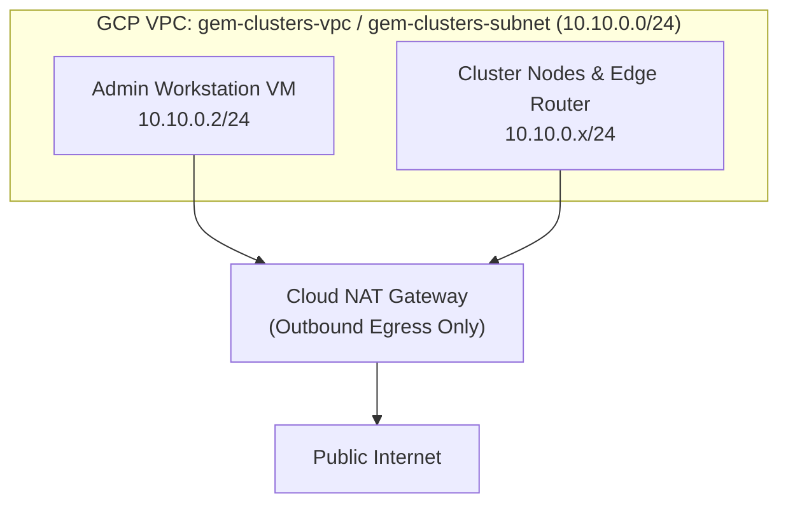

# Manually Configuring your GCP Project for GEM

[`project-setup.sh`](../project-setup.sh) and the
[`terraform/foundation`](../terraform/foundation) module automate initial GCP
project setup. Follow the steps below if you need to configure a dedicated GCP
project for GEM by hand instead.

Before running the commands below, make sure the environment variables from
[Environment Setup](../README.md#environment-setup) are exported, along with the
derived region and Artifact Registry location variables that `project-setup.sh`
computes from `GEM_GCP_ZONE`:

```bash
export GEM_GCP_REGION="${GEM_GCP_ZONE%-*}"
export GEM_AR_LOCATION="${GEM_GCP_REGION}"
```

## Enabling Required GCP Service APIs

GCP requires each Service API to be enabled in the project before you can create
resources that depend on it. [`project-setup.sh`](../project-setup.sh) enables
the bootstrap APIs, and
[`terraform/foundation/main.tf`](../terraform/foundation/main.tf) enables the
remaining Anthos, GKE Hub, and observability APIs:

- `cloudresourcemanager.googleapis.com` queries and updates project IAM policy
  bindings.
- `serviceusage.googleapis.com` lets Terraform and `gcloud` inspect active
  service endpoints and project quotas.
- `iamcredentials.googleapis.com` issues short-lived credentials for service
  account impersonation.
- `compute.googleapis.com` provisions Compute Engine VMs, disks, VPC networks,
  subnets, and firewall rules.
- `gkeconnect.googleapis.com` and `gkehub.googleapis.com` register cluster fleet
  memberships.
- `connectgateway.googleapis.com` proxies `kubectl` traffic to private clusters
  through Connect Gateway.

### Manual Execution

Enable the bootstrap and foundation APIs from your terminal:

```bash
gcloud services enable \
  cloudresourcemanager.googleapis.com \
  serviceusage.googleapis.com \
  iamcredentials.googleapis.com \
  compute.googleapis.com \
  storage.googleapis.com \
  secretmanager.googleapis.com \
  cloudbuild.googleapis.com \
  artifactregistry.googleapis.com \
  anthos.googleapis.com \
  anthosaudit.googleapis.com \
  anthosconfigmanagement.googleapis.com \
  anthosgke.googleapis.com \
  connectgateway.googleapis.com \
  container.googleapis.com \
  gkeconnect.googleapis.com \
  gkehub.googleapis.com \
  gkeonprem.googleapis.com \
  iam.googleapis.com \
  iap.googleapis.com \
  kubernetesmetadata.googleapis.com \
  logging.googleapis.com \
  monitoring.googleapis.com \
  networkmanagement.googleapis.com \
  opsconfigmonitoring.googleapis.com \
  stackdriver.googleapis.com \
  --project="${PROJECT_ID}"
```

### Verification

Confirm in the GCP Console under **APIs & Services > Enabled APIs & services**
that each service above shows `Enabled`.

## Creating a Terraform Remote State Storage Bucket

Terraform stores its `.tfstate` files in a Google Cloud Storage (GCS) bucket so
that local CLI runs, [`ansible/inventory.sh`](../ansible/inventory.sh), Cloud
Build pipelines, and the GEM API share a single source of state:

- **State locking**: GCS serializes concurrent Terraform operations against the
  same prefix.
- **Point-in-time recovery**: Object versioning retains prior state snapshots so
  you can roll back if a state file is corrupted.

### Manual Execution

Create the GCS bucket in `${GEM_GCP_REGION}` and enable object versioning:

```bash
# Create the storage bucket in your configured region
gcloud storage buckets create "gs://${TF_STATE_BUCKET}" \
  --project="${PROJECT_ID}" \
  --location="${GEM_GCP_REGION}"

# Enable Object Versioning on the bucket
gcloud storage buckets update "gs://${TF_STATE_BUCKET}" \
  --versioning
```

### Verification

Confirm in the GCP Console under **Cloud Storage > Buckets** that
`gs://${TF_STATE_BUCKET}` exists in `${GEM_GCP_REGION}` with **Object
Versioning** enabled.

## Establishing the Provisioner Service Account

Rather than running Terraform under your personal user credentials,
`project-setup.sh` creates a dedicated provisioning service account
(`tf-provisioner`) and grants it the project roles required to manage GEM
infrastructure:

- `roles/editor` grants baseline read/write access across project resources.
- `roles/iam.serviceAccountAdmin` lets Terraform create and manage the
  cluster-level service accounts (`baremetal-gcr` and `gem-cluster-admin`).
- `roles/compute.admin` lets Terraform create disks, firewall rules, VPC
  networks, and GCE VMs with nested virtualization.
- `roles/resourcemanager.projectIamAdmin` lets Terraform bind project IAM roles
  to the cluster service accounts.
- `roles/serviceusage.serviceUsageAdmin` lets Terraform enable project-level
  Service APIs.
- `roles/secretmanager.admin` lets Terraform create and manage the Cloud Build
  SSH key secret.

### Service Account Impersonation

GEM uses service account impersonation instead of exported JSON service account
keys. Granting your GCP user account `roles/iam.serviceAccountTokenCreator` on
`tf-provisioner` lets GCP mint short-lived (1-hour) OAuth2 access tokens on
demand.

The Token Creator binding only permits impersonation; it does not activate it
automatically. Terraform's `google` provider impersonates `tf-provisioner` when
`GOOGLE_IMPERSONATE_SERVICE_ACCOUNT` is set in the environment or when
`impersonate_service_account` is configured on the provider via
`provisioning_sa_email`. Export the variable before running `terraform`
commands:

```bash
export GOOGLE_IMPERSONATE_SERVICE_ACCOUNT="${PROVISIONING_SA_EMAIL}"
```

Without impersonation configured, Terraform falls back to your user credentials
and fails with `403` permission errors even though `tf-provisioner` holds the
required roles.

### Manual Execution

Create `tf-provisioner`, bind its project roles, and grant your user account
Token Creator access:

1. Create the service account:
   ```bash
   gcloud iam service-accounts create "tf-provisioner" \
     --display-name="Terraform Provisioning SA for GEM" \
     --project="${PROJECT_ID}"
   ```
2. Bind the project-level IAM roles:
   ```bash
   PROVISIONING_SA_EMAIL="tf-provisioner@${PROJECT_ID}.iam.gserviceaccount.com"
   ROLES=(
     "roles/editor"
     "roles/iam.serviceAccountAdmin"
     "roles/compute.admin"
     "roles/resourcemanager.projectIamAdmin"
     "roles/serviceusage.serviceUsageAdmin"
     "roles/secretmanager.admin"
   )

   for role in "${ROLES[@]}"; do
     gcloud projects add-iam-policy-binding "${PROJECT_ID}" \
       --member="serviceAccount:${PROVISIONING_SA_EMAIL}" \
       --role="${role}" \
       --condition=None
   done
   ```
3. Grant your GCP user account permission to impersonate `tf-provisioner`:
   ```bash
   USER_EMAIL=$(gcloud config get-value account)
   gcloud iam service-accounts add-iam-policy-binding "${PROVISIONING_SA_EMAIL}" \
     --member="user:${USER_EMAIL}" \
     --role="roles/iam.serviceAccountTokenCreator" \
     --project="${PROJECT_ID}"
   ```

### Verification

Confirm in the GCP Console under **IAM & Admin > Service Accounts** that
`tf-provisioner` exists and lists your user account as a **Service Account Token
Creator** under its **Permissions** tab.

## Local State Configuration (`backend.tf` and `terraform.tfvars`)

Once the APIs, state bucket, and `tf-provisioner` service account exist, you
have everything `project-setup.sh` creates in GCP. Generate the local variable
and backend files inside your cloned repository so Terraform can synchronize
remote state.

### 1. Generate Local Variable Files (`terraform.tfvars`)

Create the `terraform.tfvars` file in each Terraform module directory:

```bash
# Foundation Var File
cat <<EOF > "${REPO_ROOT}/terraform/foundation/terraform.tfvars"
project_id            = "${PROJECT_ID}"
provisioning_sa_email = "${PROVISIONING_SA_EMAIL}"
zone                  = "${GEM_GCP_ZONE}"
region                = "${GEM_GCP_REGION}"
EOF

# Workstation Var File
cat <<EOF > "${REPO_ROOT}/terraform/admin-workstation/terraform.tfvars"
project_id            = "${PROJECT_ID}"
provisioning_sa_email = "${PROVISIONING_SA_EMAIL}"
zone                  = "${GEM_GCP_ZONE}"
region                = "${GEM_GCP_REGION}"
EOF

# Edge Router Var File
cat <<EOF > "${REPO_ROOT}/terraform/edge-router/terraform.tfvars"
project_id            = "${PROJECT_ID}"
provisioning_sa_email = "${PROVISIONING_SA_EMAIL}"
zone                  = "${GEM_GCP_ZONE}"
region                = "${GEM_GCP_REGION}"
EOF

# Cluster Var File
cat <<EOF > "${REPO_ROOT}/terraform/cluster/terraform.tfvars"
project_id            = "${PROJECT_ID}"
provisioning_sa_email = "${PROVISIONING_SA_EMAIL}"
cluster_name          = "${CLUSTER_NAME}"
zone                  = "${GEM_GCP_ZONE}"
region                = "${GEM_GCP_REGION}"
hardware_variant      = "g2-small-64gb" # Options: g1-medium, g1-large, g2-small-64gb, g2-small-128gb, g2-medium, g2-large, dev-and-test
EOF

# Cloud Build Var File
cat <<EOF > "${REPO_ROOT}/terraform/cloudbuild/terraform.tfvars"
project_id            = "${PROJECT_ID}"
provisioning_sa_email = "${PROVISIONING_SA_EMAIL}"
zone                  = "${GEM_GCP_ZONE}"
region                = "${GEM_GCP_REGION}"
ar_location           = "${GEM_AR_LOCATION}"
EOF
```

### 2. Generate Remote Backend Files (`backend.tf`)

Configure each Terraform module to use your GCS bucket for remote state
management instead of local disk:

```bash
for dir in foundation admin-workstation edge-router cluster cloudbuild; do
  cat <<EOF > "${REPO_ROOT}/terraform/${dir}/backend.tf"
terraform {
  backend "gcs" {}
}
EOF
done
```

At this point you have replicated everything `project-setup.sh` does. To follow
the standard Terraform workflow, proceed directly to
[Deploy Foundation and Admin Workstation](../README.md#deploy-foundation-and-admin-workstation)
in the README.

> [!IMPORTANT]
> The two sections below document the VPC network, firewall rules, Cloud NAT,
> and cluster service accounts that `terraform/foundation` manages. Do **not**
> run the `gcloud` commands below if you plan to run `terraform apply` in
> `terraform/foundation`, or Terraform will fail with `409 Already Exists`
> errors on every pre-created resource. Run them only if you are bypassing
> `terraform/foundation` completely.

## Foundation VPC Network Reference (`terraform/foundation`)

[`terraform/foundation`](../terraform/foundation/main.tf) creates an isolated
VPC network (`gem-clusters-vpc`) so all GEM VMs run without public IP addresses.



### Network Resources

`terraform/foundation` provisions the following network resources:

- **VPC network (`gem-clusters-vpc`)**: A custom-mode VPC with
  `auto_create_subnetworks = false` so only explicitly declared subnets exist.
- **Subnetwork (`gem-clusters-subnet`)**: A regional `10.10.0.0/24` subnet in
  `${GEM_GCP_REGION}` that hosts the Admin Workstation, the Edge Router, and all
  cluster nodes.
- **Cloud Router (`gem-clusters-vpc-router`) and Cloud NAT
  (`gem-clusters-vpc-nat`)**: Provide outbound internet access so private VMs
  can download OS packages, `bmctl`, and container images without holding public
  IP addresses.
- **Internal firewall rule (`gem-clusters-allow-internal`)**: Allows all `tcp`,
  `udp`, and `icmp` traffic within `10.10.0.0/24` for instances carrying the
  `http-server` and `https-server` network tags, covering etcd, the Kubelet API,
  and UDP port `4789` VXLAN traffic.
- **IAP SSH firewall rule (`gem-clusters-allow-iap-ssh`)**: Allows TCP port `22`
  ingress from Google Cloud's Identity-Aware Proxy (IAP) range
  (`35.235.240.0/20`) to instances tagged `http-server` and `https-server`.

### Manual Execution (Only When Bypassing `terraform/foundation`)

Create the VPC, subnet, firewall rules, Cloud Router, and Cloud NAT gateway:

1. **Create the VPC Network**:
   ```bash
   gcloud compute networks create "gem-clusters-vpc" \
     --project="${PROJECT_ID}" \
     --subnet-mode=custom
   ```
2. **Create the Subnetwork**:
   ```bash
   gcloud compute networks subnets create "gem-clusters-subnet" \
     --project="${PROJECT_ID}" \
     --network="gem-clusters-vpc" \
     --region="${GEM_GCP_REGION}" \
     --range="10.10.0.0/24"
   ```
3. **Create the Internal Firewall Rule**:
   ```bash
   gcloud compute firewall-rules create "gem-clusters-allow-internal" \
     --project="${PROJECT_ID}" \
     --network="gem-clusters-vpc" \
     --allow=tcp,udp,icmp \
     --source-ranges="10.10.0.0/24" \
     --target-tags="http-server","https-server"
   ```
4. **Create the IAP SSH Firewall Rule**:
   ```bash
   gcloud compute firewall-rules create "gem-clusters-allow-iap-ssh" \
     --project="${PROJECT_ID}" \
     --network="gem-clusters-vpc" \
     --allow=tcp:22 \
     --source-ranges="35.235.240.0/20" \
     --target-tags="http-server","https-server"
   ```
5. **Create the Cloud Router**:
   ```bash
   gcloud compute routers create "gem-clusters-vpc-router" \
     --project="${PROJECT_ID}" \
     --network="gem-clusters-vpc" \
     --region="${GEM_GCP_REGION}"
   ```
6. **Create and Bind the Cloud NAT Gateway**:
   ```bash
   gcloud compute routers nats create "gem-clusters-vpc-nat" \
     --project="${PROJECT_ID}" \
     --router="gem-clusters-vpc-router" \
     --region="${GEM_GCP_REGION}" \
     --auto-allocate-nat-external-ips \
     --nat-all-subnet-ip-ranges
   ```

### Verification

Confirm in the GCP Console under **VPC network > VPC networks** that
`gem-clusters-vpc` contains `gem-clusters-subnet` (`10.10.0.0/24`), both
firewall rules are active, and `gem-clusters-vpc-nat` appears under **Network
services > Cloud NAT**.

## Fleet Registry and GCR Service Accounts Reference (`terraform/foundation`)

[`terraform/foundation`](../terraform/foundation/main.tf) also creates two
project-wide service accounts used by Anthos Bare Metal clusters:

- **`baremetal-gcr`**: Runs on the cluster nodes and the Admin Workstation to
  pull Anthos Bare Metal container images, register GKE Hub fleet memberships,
  and export logs and metrics to Cloud Logging and Cloud Monitoring.
- **`gem-cluster-admin`**: Authenticates remote `kubectl` sessions through GKE
  Connect Gateway. During cluster creation, Ansible binds this service account
  to the Kubernetes `cluster-admin` `ClusterRole` so authorized users can
  administer private clusters through Connect Gateway.

### Manual Execution (Only When Bypassing `terraform/foundation`)

Create both service accounts and bind the IAM roles declared in
[`terraform/foundation/main.tf`](../terraform/foundation/main.tf):

1. Create the `baremetal-gcr` service account:
   ```bash
   gcloud iam service-accounts create "baremetal-gcr" \
     --display-name="Service Account for Anthos Bare Metal" \
     --project="${PROJECT_ID}"
   ```
2. Bind the `baremetal-gcr` project IAM roles:
   ```bash
   BAREMETAL_SA_EMAIL="baremetal-gcr@${PROJECT_ID}.iam.gserviceaccount.com"
   BAREMETAL_ROLES=(
     "roles/gkehub.connect"
     "roles/gkehub.admin"
     "roles/logging.logWriter"
     "roles/monitoring.metricWriter"
     "roles/monitoring.dashboardEditor"
     "roles/stackdriver.resourceMetadata.writer"
     "roles/opsconfigmonitoring.resourceMetadata.writer"
     "roles/kubernetesmetadata.publisher"
     "roles/compute.viewer"
     "roles/serviceusage.serviceUsageViewer"
   )

   for role in "${BAREMETAL_ROLES[@]}"; do
     gcloud projects add-iam-policy-binding "${PROJECT_ID}" \
       --member="serviceAccount:${BAREMETAL_SA_EMAIL}" \
       --role="${role}" \
       --condition=None
   done
   ```
3. Create the `gem-cluster-admin` service account:
   ```bash
   gcloud iam service-accounts create "gem-cluster-admin" \
     --display-name="GEM Cluster Admin" \
     --project="${PROJECT_ID}"
   ```
4. Bind the `gem-cluster-admin` project IAM roles:
   ```bash
   ADMIN_SA_EMAIL="gem-cluster-admin@${PROJECT_ID}.iam.gserviceaccount.com"
   ADMIN_ROLES=(
     "roles/gkehub.gatewayAdmin"
     "roles/gkehub.admin"
   )

   for role in "${ADMIN_ROLES[@]}"; do
     gcloud projects add-iam-policy-binding "${PROJECT_ID}" \
       --member="serviceAccount:${ADMIN_SA_EMAIL}" \
       --role="${role}" \
       --condition=None
   done
   ```

### Verification

Confirm in the GCP Console under **IAM & Admin > Service Accounts** that both
`baremetal-gcr` and `gem-cluster-admin` exist and hold their project IAM role
bindings under **IAM & Admin > IAM**.
