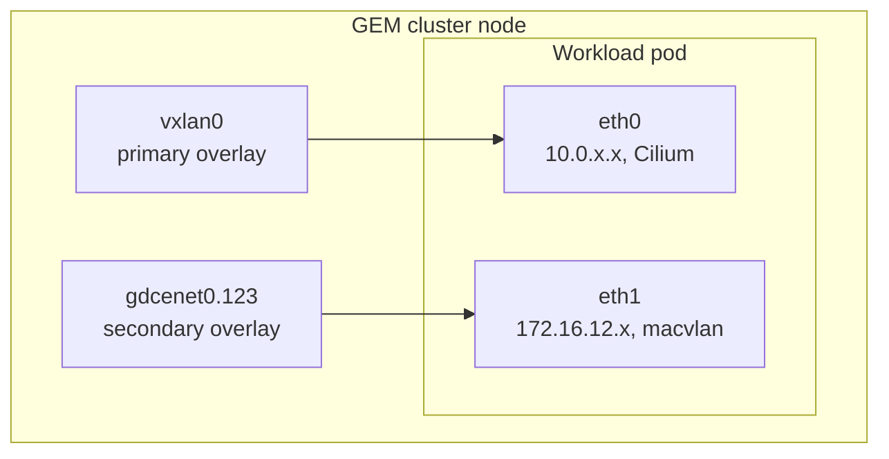
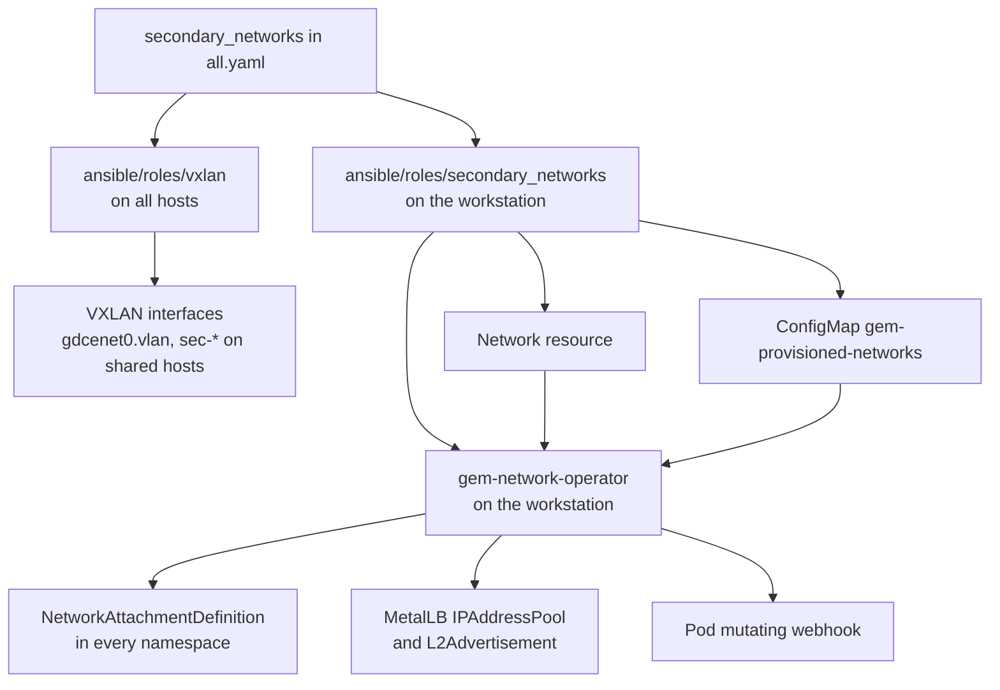
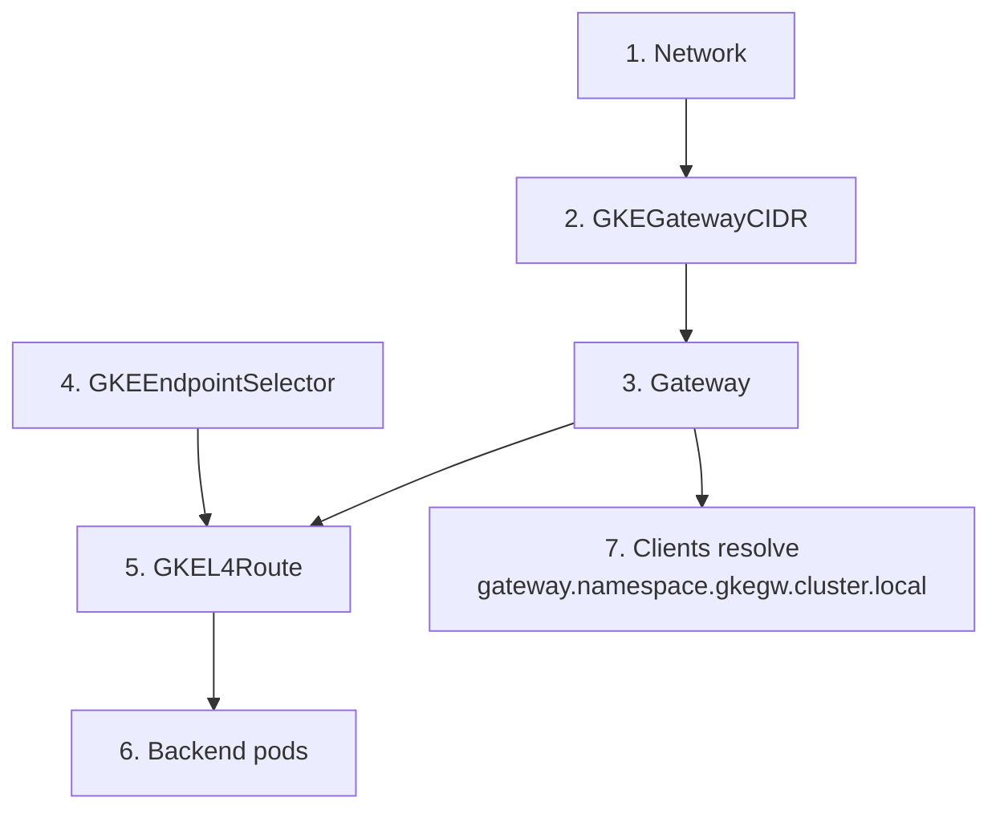

# GEM Secondary Networks

Secondary networks give workload pods a second network interface on an isolated
L2 segment, separate from the primary Cilium pod network. On physical GDC
Connected hardware these are 802.1Q VLANs trunked from a top-of-rack switch. GEM
emulates them with a VXLAN overlay mesh across GCE instances.

For the operator's internal design, see
[gem-network-operator implementation](gem-network-operator-implementation.md).

## Why this exists

Enterprise and edge workloads frequently require network segmentation for
regulatory, security, or multi-tenant isolation reasons. A GDC cluster therefore
operates on two tiers:

1. **The primary network.** An L3 network configured at cluster provisioning
   time, used for control plane traffic, pod-to-pod overlay routing, and
   Kubernetes API egress.
2. **Secondary networks.** Additional isolated L2 segments that nodes and pods
   bind to directly for data-plane traffic, edge device communication, or
   compliance isolation.

A pod on a secondary network gets an `eth1` interface on the secondary network
segment in addition to its primary `eth0` interface, which is configured on the
cluster primary network.



## Physical GDC compared with GEM

| Behavior                            | Physical GDC Connected                                         | GEM on GCE                                                     |
| :---------------------------------- | :------------------------------------------------------------- | :------------------------------------------------------------- |
| Underlay transport                  | Top-of-rack switch fabric with 802.1Q trunking                 | Flat custom-mode VPC, `gem-clusters-vpc`                       |
| Secondary encapsulation             | Native 802.1Q tagged frames on a physical NIC                  | VXLAN overlay mesh on UDP port 4789                            |
| Interface MTU                       | 1500, or 9000 with jumbo frames                                | Fixed at 1410                                                  |
| Arbitrary VLAN IDs, for example 123 | Intra-node only. Switches drop unconfigured tags between nodes | Full multi-node routing. GEM builds an overlay for any VLAN ID |
| Production trunked VLANs            | Full multi-node routing                                        | Full multi-node routing via mapped VNIs                        |

> [!IMPORTANT]
> On a GEM node, `gdcenet0.123` is a VXLAN device whose name happens to contain
> a dot. It is **not** an 802.1Q sub-interface of a parent named `gdcenet0`, and
> no such parent exists. The name is chosen so that unmodified GDC `Network`
> resources, which match on `interfaceName: gdcenet0.<vlan_id>`, find it.

## Configuring a secondary network

Secondary networks are optional and are declared in
`ansible/group_vars/all.yaml`. An example of which is:

```yaml
secondary_networks:
  - name: "vlan-123"
    vlan_id: 123
    subnet: "172.16.12.0/24"
    gateway: "172.16.12.1"
    vip_pool: "172.16.12.200-172.16.12.250"
    pod_cidr: "10.12.0.0/22"
    per_node_ipam_size: 24
```

Every key is required. The template applies no `default()` filters, so omitting
`pod_cidr` or `per_node_ipam_size` fails the role even though the operator
ignores both values.

| Key                  | Type    | Meaning                                                                                                                                       |
| :------------------- | :------ | :-------------------------------------------------------------------------------------------------------------------------------------------- |
| `name`               | string  | Name of the `Network` resource, the NetworkAttachmentDefinition, and the MetalLB pool (`<name>-pool`)                                         |
| `vlan_id`            | integer | Node interface suffix, `gdcenet0.<vlan_id>`. Valid range 1 to 4094, though only the REST API enforces it                                      |
| `subnet`             | CIDR    | The segment. Supplies host addresses and `prefixLength4`                                                                                      |
| `gateway`            | IP      | The segment's default gateway. The edge router binds this address, providing a return path to external traffic routed through the edge router |
| `vip_pool`           | range   | MetalLB address **range** in `start-end` form, not CIDR                                                                                       |
| `pod_cidr`           | CIDR    | Rendered into an annotation. Not read by the operator                                                                                         |
| `per_node_ipam_size` | integer | Rendered into an annotation. Not read by the operator                                                                                         |

`vip_pool` is a MetalLB-style range despite being rendered into an annotation
named `gdce-lb-service-vip-cidrs`. It is passed through verbatim into
`IPAddressPool.spec.addresses`.

> [!CAUTION]
> **Secondary networks are build-time only.** The `secondary_networks` role runs
> exclusively from `create-cluster.yaml`, and it is the only thing that writes
> the `Network` resource and the provisioning ConfigMap. Applying a `Network` to
> a running cluster produces a resource stuck at `Ready=False` with reason
> `MissingHostInterface`. Adding a secondary network means rebuilding the
> cluster. Re-running `restore-vxlan.yaml` against a live cluster does create
> the host interfaces, but it also reassigns VNIs, described under
> [VNI derivation](#vni-derivation).

Once your secondary networks are configured, build the cluster as usual:

```bash
cd ansible
PROJECT_ID=${PROJECT_ID} CLUSTER_NAME=${CLUSTER_NAME} \
  ansible-playbook create-cluster.yaml
```

The [GEM REST API](gem-api.md) accepts a `secondary_networks` array on cluster
create, which overrides the `all.yaml` list for that build. On that path
`pod_cidr` and `per_node_ipam_size` are optional and default.

## How a secondary network is built

The Ansible `vxlan` role builds the data plane, the `secondary_networks` role
declares the intent in Kubernetes, and `gem-network-operator` translates that
intent into Multus and MetalLB objects. The `secondary_networks` role also
applies the CRDs, including the upstream Gateway API bundle, before the operator
starts.



The operator is not a workload on the cluster. It runs as a per-cluster systemd
unit on the shared admin workstation, and the API server reaches its mutating
webhook over the network. That is the reason `failurePolicy: Ignore` matters: if
the unit is down or the workstation is unreachable, pods are admitted without
their secondary interfaces and nothing reports an error. See
[Admin Workstation](admin-workstation.md#what-runs-on-it).

### Interface and address assignment

| Host              | Primary interface      | Secondary interface        | Secondary address                               |
| :---------------- | :--------------------- | :------------------------- | :---------------------------------------------- |
| Cluster nodes     | `vxlan0`               | `gdcenet0.<vlan_id>`       | `<subnet>.<host_octet>/24`, node octets 2, 3, 4 |
| Admin workstation | `vx-<cluster6>-<vni4>` | `sec-<cluster6>-<vlan_id>` | `<subnet>.100/24`                               |
| Edge router       | `vx-<cluster6>-<vni4>` | `sec-<cluster6>-<vlan_id>` | The network's `gateway` address                 |

Nodes keep unqualified names so GDC resources and MetalLB discover them. The
workstation and edge router attach to every cluster at once, so their interface
names are cluster-scoped and truncated to fit the 15-character Linux limit.

The edge router deliberately takes the `gateway` address. It is emulating the
top-of-rack switch that would be the default gateway on physical hardware, which
is what makes it able to route between segments and terminate developer tunnels.

> [!NOTE]
> Every host except the edge router gets a hardcoded `/24`, because the address
> is built by taking the first three octets of `subnet` and appending the host
> octet. The edge router and the `Network` resource use the real prefix. A
> `subnet` that is not a `/24` therefore produces an inconsistent data plane.
> Use `/24` segments.

### VNI derivation

Each cluster has a primary VNI derived from its name,
`cksum(cluster_name) % 16000000 + 100`, emitted by `ansible/inventory.sh`.

Each secondary network's VNI is that value plus the network's position in the
list, counting from one. The first entry gets the cluster VNI plus one, the
second plus two, and so on. The VLAN ID never enters the calculation.

> [!WARNING]
> Reordering, inserting, or removing an entry in `secondary_networks` and
> re-running the `vxlan` role against a live cluster silently reassigns VNIs for
> unrelated networks and breaks cross-node traffic on them. Append new entries
> at the end, and treat any reordering as requiring a cluster rebuild.

### MTU and MSS

1410 appears in the VXLAN netdev (`MTUBytes=1410`), in the `Network` resource's
`gdce-vlan-mtu` annotation, and as the operator's `DefaultVLANMTU`. The
annotation is what reaches the NetworkAttachmentDefinition; `DefaultVLANMTU` is
only the fallback for a `Network` that carries no annotation. Keep the netdev
and the annotation in agreement, or pods get an MTU their host interface cannot
carry.

The per-cluster unit `vxlan-tcpmss-<cluster>.service` clamps TCP MSS on every
overlay interface, secondary networks included. Without it, large TLS payloads
are dropped silently and handshakes appear to hang.

### Persistence across rebuilds

The workstation's and edge router's interface files are mirrored to
`gs://gem-${PROJECT_ID}-overlay-sync/<host>/` and pulled back by a one-minute
cron job. This covers `/etc/systemd/network` only; MSS clamping units are not
restored. See [Edge Router](edge-router.md) and
[Admin Workstation](admin-workstation.md).

## Kubernetes resources

### The `Network` resource

Rendered by Ansible, one per entry:

```yaml
apiVersion: networking.gke.io/v1
kind: Network
metadata:
  name: vlan-123
  annotations:
    networking.gke.io/gdce-vlan-id: "123"
    networking.gke.io/gdce-vlan-mtu: "1410"
    networking.gke.io/gdce-lb-service-vip-cidrs: '["172.16.12.200-172.16.12.250"]'
    networking.gke.io/gke-gateway-pod-cidr: "10.12.0.0/22"
    networking.gke.io/gdce-per-node-ipam-size: "24"
spec:
  type: L2
  IPAMMode: Internal
  nodeInterfaceMatcher:
    interfaceName: gdcenet0.123
  gateway4: "172.16.12.1"
  l2NetworkConfig:
    prefixLength4: 24
  dnsConfig:
    nameservers:
      - 8.8.8.8
```

What the operator actually reads: `gateway4`, `l2NetworkConfig.prefixLength4`,
`nodeInterfaceMatcher.interfaceName`, `gdce-vlan-id`, `gdce-vlan-mtu`,
`gdce-lb-service-vip-cidrs`, and `gdce-allowed-namespaces` when present.

`spec.type`, `IPAMMode` and `dnsConfig` are accepted for schema fidelity with
real GDC manifests but are not read. GEM always emulates the segment as an L2
macvlan attachment. `gke-gateway-pod-cidr` and `gdce-per-node-ipam-size` are
inert.

`prefixLength4` is declared as an int-or-string in the CRD but is read as an
integer. Quote it and it silently falls back to 24.

### The provisioning guardrail

Host interfaces only exist if the `vxlan` role created them, so a `Network` can
name an interface that is not there on any node. Ansible records what was
actually provisioned in a ConfigMap:

```yaml
apiVersion: v1
kind: ConfigMap
metadata:
  name: gem-provisioned-networks
  namespace: kube-system
data:
  "123": gdcenet0.123
```

The operator matches each `Network` against it, by VLAN ID first and then by
interface name. On a miss it emits a `MissingHostInterface` warning event and
sets `Ready=False`. Networks named `pod-network` or `default` are exempt by
name, as are networks that declare neither a VLAN ID nor an interface name.

> [!IMPORTANT]
> The guardrail reports, it does not gate. The NetworkAttachmentDefinitions, the
> MetalLB pool and the L2Advertisement are created whether or not the host
> interface was provisioned, so `Ready=False` is a diagnosis rather than an
> interlock. A pod can attach to a network that has no data plane behind it.

Each `Network` carries two status conditions:

| Condition      | Meaning                                                                          |
| :------------- | :------------------------------------------------------------------------------- |
| `Ready`        | `NetworkReady`, or `MissingHostInterface`, or `ChildResourceError`               |
| `CoreDNSReady` | Whether `kube-system/coredns-config` contains the `.gkegw.cluster.local` rewrite |

> [!NOTE]
> `Ready=True` means the guardrail passed and the child objects were written. It
> does not verify that the interface is actually up on every node.

A cluster built with no `secondary_networks` at all never gets the ConfigMap, so
every `Network` added afterwards reports `MissingHostInterface`.

### Generated objects

For each `Network`, the operator creates:

- A `NetworkAttachmentDefinition` named after the network **in every
  non-terminating namespace**, configured as `macvlan` in `bridge` mode with
  `master` set to the host interface, the network's MTU, and `host-local` IPAM
  whose subnet is derived from `gateway4` and `prefixLength4`. Namespaces
  created later are backfilled.
- A MetalLB `IPAddressPool` named `<network>-pool` in `kube-system` with
  `autoAssign: false` and the addresses from the VIP annotation.
- A MetalLB `L2Advertisement` named `l2advertise-<network>` restricted to that
  host interface.

All three carry an owner reference to the `Network`, and a finalizer removes
them when it is deleted.

Because `autoAssign` is false, a `Service` must opt in. Annotate it with
`networking.gke.io/network: <network>` and the operator binds it to that pool. A
network can also restrict which namespaces may bind, using
`networking.gke.io/gdce-allowed-namespaces`; a denied binding emits a
`ServiceBindingDenied` warning.

## Attaching a pod

Declare interfaces with the standard GDC annotation:

```yaml
apiVersion: v1
kind: Pod
metadata:
  name: secondary-network-server
  labels:
    app: secondary-network-svc
  annotations:
    networking.gke.io/default-interface: eth0
    networking.gke.io/interfaces: |
      [
        {"interfaceName":"eth0","network":"pod-network"},
        {"interfaceName":"eth1","network":"vlan-123"}
      ]
spec:
  containers:
    - name: nginx
      image: nginx:alpine
      ports:
        - containerPort: 80
```

A mutating admission webhook, registered as `gem-pod-interface-mutator`,
intercepts pod creation and rewrites this into something Multus understands:

1. It splits the declared interfaces into primary (`pod-network`, `default`, or
   empty) and secondary.
2. For each secondary interface it allocates an address and injects a
   `k8s.v1.cni.cncf.io/networks` entry carrying an explicit `ips` value. The
   allocator excludes the network and broadcast addresses, the gateway, a fixed
   `.2` to `.9` window for node addresses, the MetalLB VIP ranges, any
   `GKEGatewayCIDR` ranges for that network, and every address already claimed
   in another live pod's annotations.
3. It rewrites `networking.gke.io/interfaces` to list only the primary
   interfaces, so Cilium configures `eth0` and leaves `eth1` alone.
4. It sets `networking.gke.io/default-interface: eth0` if absent.

Constraints worth knowing:

- The webhook fires on pod **CREATE** only. Adding the annotation to an existing
  pod has no effect.
- `kube-system`, `gatekeeper-system`, and `gke-system` are excluded.
- `failurePolicy` is `Ignore`. If the operator is down, pods are admitted
  unmutated, so they come up with no secondary interface and no error. A pod
  that is missing `eth1` is the symptom.
- The node exclusion window is `.2` to `.9`, so it does not cover the admin
  workstation's `<subnet>.100`. A pod can be handed the workstation's own
  secondary address.

## Multi-network Services with the Gateway API

A standard `Service` is tied to the primary pod network. To expose a service on
a secondary network with a stable VIP and DNS, GDC uses the Multi-Network
Gateway API, which GEM reimplements in `gem-network-operator`.



Declare the VIP pool that Gateways on this network draw from:

```yaml
apiVersion: networking.gke.io/v1
kind: GKEGatewayCIDR
metadata:
  name: vlan-123
spec:
  ip4cidr: 172.16.12.224/27
  network: vlan-123
```

Declare the Gateway. The `networking.gke.io/network` annotation is what ties it
to the network, and therefore to the CIDR it draws its VIP from:

```yaml
apiVersion: gateway.networking.k8s.io/v1
kind: Gateway
metadata:
  name: vlan-123-gateway
  annotations:
    networking.gke.io/network: vlan-123
spec:
  gatewayClassName: gke-cluster-ip
  listeners:
    - name: vlan-123-service
      protocol: TCP
      port: 80
      allowedRoutes:
        kinds:
          - kind: GKEL4Route
```

> [!NOTE]
> GEM's operator does not read `spec.gatewayClassName`, `spec.listeners`, or
> `allowedRoutes`, and no `GatewayClass` object exists in the cluster. They are
> carried for schema fidelity with physical GDC manifests. The port a backend is
> actually reached on comes from the `GKEL4Route` below, not from the listener.

Select backends and bind them:

```yaml
apiVersion: networking.gke.io/v1
kind: GKEEndpointSelector
metadata:
  name: vlan-123-endpointselector
spec:
  network: vlan-123
  selector:
    matchLabels:
      app: secondary-network-svc
---
apiVersion: networking.gke.io/v1
kind: GKEL4Route
metadata:
  name: vlan-123-l4route
spec:
  parentRefs:
    - name: vlan-123-gateway
  rules:
    - name: vlan-123-service
      backendRefs:
        - kind: GKEEndpointSelector
          port: 80
          group: networking.gke.io
          name: vlan-123-endpointselector
```

`backendRefs[].port` is the one field here that changes behavior, and it
defaults to 80 if you omit it. The operator matches backends on
`selector.matchLabels` alone.

The operator assigns the Gateway a VIP from the matching `GKEGatewayCIDR`,
creates a headless `Service` with that address in `externalIPs`, and populates
an `EndpointSlice` named `<gateway>-slice` with the pods' **secondary**
addresses, read from their `k8s.v1.cni.cncf.io/network-status`. Only pods that
are `Running` and `Ready` are included. It also installs a CoreDNS rewrite so
`<gateway>.<namespace>.gkegw.cluster.local` resolves to the corresponding
`svc.cluster.local` name.

To pin a Gateway to a specific address rather than letting the operator choose,
set `spec.addresses[0].value`. That takes precedence over CIDR allocation.

## Ordering constraints

These rules come from end-to-end validation on both physical GDC and GEM.

### Create `GKEGatewayCIDR` before backend pods

Pods are effectively immutable once created, and pod admission is the only point
at which secondary networking is configured.

On physical GDC, the admission webhook injects the Gateway VIP route into the
pod's network namespace at scheduling time, so a pod created first has no route
to the VIP and requests time out.

In GEM the mechanism differs but the ordering still matters: the pod mutator
consults existing `GKEGatewayCIDR` resources to **exclude** those addresses from
pod IPAM. A pod created first can be assigned an address inside the Gateway CIDR
and collide with a VIP allocated later.

### Delete routes before their parents

Delete `GKEL4Route` before the `Gateway`, `GKEEndpointSelector`, and
`GKEGatewayCIDR` it references.

On physical GDC, `GKEL4Route` carries a finalizer that the `gke-cluster-ip`
controller only removes while the parent `Gateway` and referenced selector are
still present. Deleting the Gateway first leaves the route stuck `Terminating`
and blocks namespace deletion.

GEM's operator does not implement that finalizer, so the deadlock does not occur
here. Keep to the ordering anyway if your manifests are shared with physical
GDC.

### Allow generous deletion timeouts

Deleting a `Network` runs a finalizer that removes its
NetworkAttachmentDefinition from every namespace, along with the MetalLB pool
and L2Advertisement, so it takes time proportional to the namespace count.
`GKEGatewayCIDR` has no finalizer in GEM and deletes immediately.

Under Connect Gateway proxying, deletion polling has been observed at roughly 75
to 90 seconds, which is why the suites set `delete: 3m` and `cleanup: 3m`. The
repo-wide Chainsaw configuration in `tests/e2e/chainsaw-configuration.yaml` sets
5m for both.

### Retry on Gateway DNS

Gateway names resolve as `<gateway>.<namespace>.gkegw.cluster.local`. Clients
should retry for up to 60 seconds after creation. Ansible installs the rewrite
rule at build time and the operator re-asserts it on each reconcile, roughly
every 30 seconds, so the delay is CoreDNS reload plus that interval rather than
record propagation.

### Do not disable `clusterdns-controller`

Both `gem-network-operator` and the Ansible role idempotently append the
`.gkegw.cluster.local` rewrite rule to `coredns-template` and `coredns-config`,
alongside the cluster's own `clusterdns-controller`, which also reconciles those
objects.

An earlier attempt scaled `clusterdns-controller` to zero to avoid the apparent
race. That broke `clusterdns-webhook` and was reverted.

The shipped approach leaves the controller running, makes the edit idempotent,
patches `coredns-template` first, and then issues a
`kubectl rollout restart deployment clusterdns-controller` so the controller
picks up the new template, which it only reads at startup.

## Verifying and troubleshooting

Check the host data plane on a cluster node:

```bash
ip link show gdcenet0.123
ip -d link show gdcenet0.123            # confirm vxlan, VNI, and MTU 1410
bridge fdb show dev gdcenet0.123        # peer entries for the other hosts
sudo iptables -t mangle -S POSTROUTING  # MSS clamping rules
```

The forwarding database entries are static, generated from the cluster's host
list at build time, so a host that was rebuilt with a different underlay IP will
be missing from its peers' tables.

An Ansible playbook checks the overlay across all nodes. It validates `vxlan0`
only, not the secondary interfaces, and it runs against cluster nodes only, so
the workstation and edge router `sec-*` interfaces go unchecked:

```bash
cd ansible
CLUSTER_NAME=${CLUSTER_NAME} ansible-playbook verify-nodes.yaml
```

Check the Kubernetes side:

```bash
kubectl get network vlan-123 -o yaml                    # Ready and CoreDNSReady
kubectl describe network vlan-123                       # MissingHostInterface events
kubectl get configmap -n kube-system gem-provisioned-networks -o yaml
kubectl get net-attach-def -A
kubectl get ipaddresspool,l2advertisement -n kube-system
kubectl get mutatingwebhookconfiguration gem-pod-interface-mutator -o yaml
kubectl get endpointslice <gateway>-slice -o yaml
kubectl get cm -n kube-system coredns-config -o jsonpath='{.data.Corefile}' | grep gkegw
```

Check the operator, on the admin workstation:

```bash
systemctl status gem-network-operator-${CLUSTER_NAME}
journalctl -u gem-network-operator-${CLUSTER_NAME} -n 200
```

| Symptom                                                      | Likely cause                                                                                                                                    |
| :----------------------------------------------------------- | :---------------------------------------------------------------------------------------------------------------------------------------------- |
| `Network` stuck `Ready=False`, reason `MissingHostInterface` | The VLAN is not in `gem-provisioned-networks`. It was added after the cluster was built                                                         |
| Every `Network` reports `MissingHostInterface`               | The cluster was built with no `secondary_networks`, so the ConfigMap was never created                                                          |
| Pod starts but has no `eth1`                                 | The webhook did not fire. `failurePolicy: Ignore` masks an operator outage. Check the unit, and confirm the pod was created rather than updated |
| Intra-node traffic works, cross-node does not                | VNI mismatch or missing forwarding database entries. Often caused by reordering `secondary_networks`                                            |
| Connections hang on large payloads or TLS                    | MSS clamping unit missing, commonly after a workstation or edge router rebuild                                                                  |
| `Service` gets no external IP                                | Missing the `networking.gke.io/network` annotation, or the namespace is not in `gdce-allowed-namespaces`                                        |
| Gateway VIP unreachable from a pod                           | The pod was created before its `GKEGatewayCIDR`                                                                                                 |

## End-to-end tests

Three Chainsaw suites live under `tests/e2e/secondary-networks/`. They exercise
`vlan-123` and `vlan-456`, so they only pass against a cluster built with both
provisioned.

| Suite          | Mechanism                                                          | Physical GDC                              | GEM    |
| :------------- | :----------------------------------------------------------------- | :---------------------------------------- | :----- |
| `intra-node/`  | `podAffinity` on the client pins it to the server's node           | Passes, including with synthetic VLAN IDs | Passes |
| `cross-node/`  | `podAntiAffinity` on the client forces it onto a different node    | Passes only on a physically trunked VLAN  | Passes |
| `pod-mutator/` | Asserts the injected `ips` and the sanitized interfaces annotation | Not applicable                            | Passes |

```bash
chainsaw test --config tests/e2e/chainsaw-configuration.yaml \
  tests/e2e/secondary-networks/intra-node
```

## Known limitations

| Limitation                                                  | Impact                                                                                                                                                   |
| :---------------------------------------------------------- | :------------------------------------------------------------------------------------------------------------------------------------------------------- |
| VNIs derive from list position                              | Reordering `secondary_networks` reassigns VNIs for unrelated networks                                                                                    |
| Networks cannot be added to a live cluster                  | Adding one requires a cluster rebuild                                                                                                                    |
| The guardrail reports rather than gates                     | Child objects are created even when no host interface exists, so a pod can attach to a network with no data plane                                        |
| `host-local` IPAM is not partitioned per node               | The webhook normally pre-allocates an address and masks this, but its exclusion window misses the workstation's `.100`, and nothing is reserved per node |
| Gateway VIP assignment is not real IPAM                     | The first host address of the matching `GKEGatewayCIDR` is always returned, so two Gateways on one CIDR collide unless you pin `spec.addresses`          |
| Node addresses are always `/24`                             | A non-`/24` `subnet` yields an inconsistent data plane                                                                                                   |
| NetworkAttachmentDefinitions are created in every namespace | Object count grows with networks multiplied by namespaces, with no opt-in                                                                                |
| The webhook handles CREATE only                             | Annotating an existing pod does nothing                                                                                                                  |
| `sec-*` interface names omit the VNI                        | Clusters sharing a six-character prefix collide on shared hosts. See [Edge Router](edge-router.md#multiple-clusters-on-one-edge-router)                  |

## Related documentation

- [gem-network-operator implementation](gem-network-operator-implementation.md)
- [GEM Networking](gem-networking.md)
- [Edge Router](edge-router.md)
- [Admin Workstation](admin-workstation.md)
