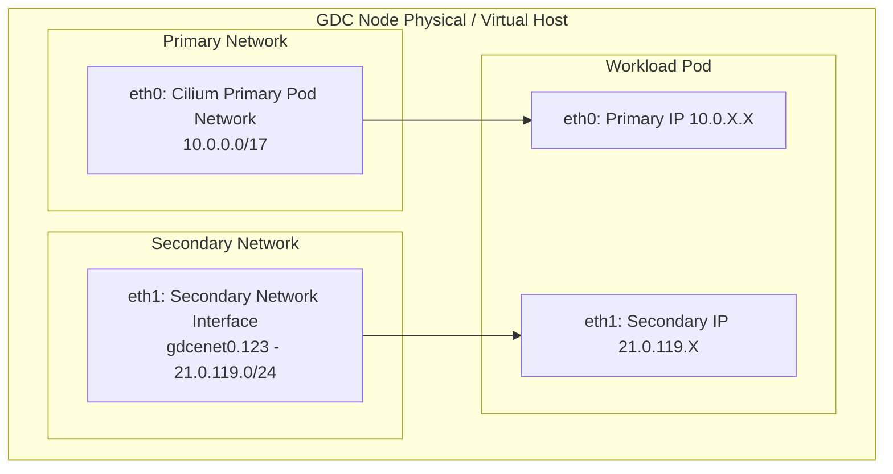
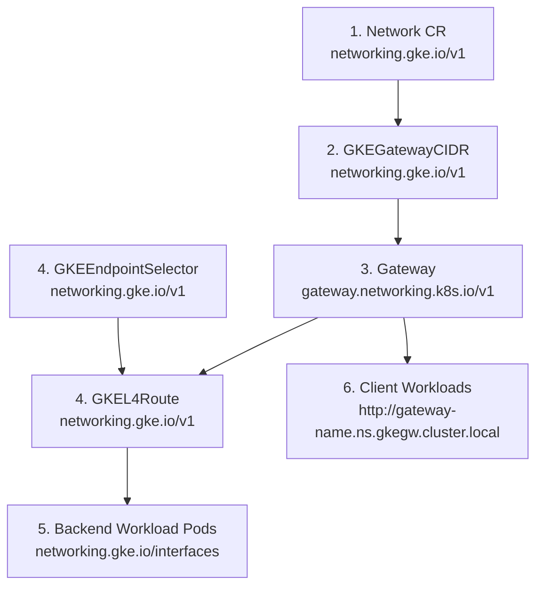

# GEM Secondary Networks & Multi-Network Gateway API Design

This document provides the comprehensive architectural specification, operational constraints, lifecycle dependency ordering, and implementation blueprint for **Secondary Networks** and **Multi-Network Gateway API (ClusterIP)** in both Google Distributed Cloud (GDC) Connected physical hardware and the GDC EMulation Environment (GEM) on Google Compute Engine (GCE).

---

## 1. Overview & Core Concepts

In enterprise and edge deployments, workloads frequently require network segmentation due to regulatory, security (e.g., PCI-DSS), and multi-tenant isolation requirements.

A GDC cluster operates on two distinct network tiers:
1. **Default Primary Network:** An L3 network configured at cluster provisioning time. Used for cluster control plane communication, pod-to-pod overlay routing (Cilium/Geneve), and Kubernetes API egress.
2. **Secondary Networks (VLANs / Subnetworks):** Up to 10 additional isolated networks that nodes and workload pods can directly bind to for dedicated data-plane traffic, edge device communication, or compliance isolation.



### Multi-Network Services via Gateway API
Standard Kubernetes `Service` (ClusterIP) objects are tied exclusively to the primary pod network. To enable multi-network pods to consume and expose services on secondary networks with native DNS, routing, and load balancing, GDC implements **Multi-Network Gateway API (ClusterIP)** powered by the `networking.gke.io/cluster-ip` controller.

---

## 2. Physical GDC vs. GEM Emulation Architecture

The underlying network plumbing differs fundamentally between physical GDC racks and the GEM emulation environment:

| Feature / Behavior | Physical GDC Connected | GEM Emulation Environment (GCE) |
| :--- | :--- | :--- |
| **Underlay Transport** | Physical Top-of-Rack (ToR) switch fabric with 802.1Q trunking | Flat GCP VPC L3 underlay (`10.10.0.0/24`) |
| **Secondary Encapsulation** | Native 802.1Q tagged Ethernet frames on NICs (`gdcenet0.<vlan_id>` / `ens224`) | Dynamic Island-Mode **VXLAN Overlay Mesh** (UDP Port `4789`) |
| **Interface MTU** | Standard physical MTU (1500 or 9000 Jumbo) | **Strictly 1410** (1460 GCE VPC MTU - 50-byte VXLAN header) |
| **Arbitrary / Synthetic VLANs (e.g. VLAN 123)** | **Intra-Node Only**. Physical switches drop unconfigured 802.1Q tags across nodes. | **Full Multi-Node Routing**. GEM establishes virtual VXLAN overlays for any requested VLAN ID. |
| **Production Trunked VLANs (e.g. 3421, 3430)** | **Full Multi-Node Routing** across physical nodes. | **Full Multi-Node Routing** via mapped VXLAN VNIs. |

---

## 3. Custom Resource Definitions & Data Model

Multi-network services on GDC are declared using standard GDC and Gateway API Custom Resources:



### 1. `Network` Custom Resource
Declares the Layer 2/3 secondary network parameters on the cluster.

```yaml
apiVersion: networking.gke.io/v1
kind: Network
metadata:
  name: test-secondary-network
  annotations:
    networking.gke.io/gdce-vlan-id: "123"
    networking.gke.io/gdce-vlan-mtu: "1500"
spec:
  type: L3
  nodeInterfaceMatcher:
    interfaceName: "gdcenet0.123"
  gateway4: "21.0.119.254"
  IPAMMode: Internal
  dnsConfig:
    nameservers:
      - 8.8.8.8
```

### 2. `GKEGatewayCIDR`
Defines the CIDR block from which Virtual IPs (VIPs) are allocated for Gateway listeners on this secondary network.

```yaml
apiVersion: networking.gke.io/v1
kind: GKEGatewayCIDR
metadata:
  name: test-secondary-network
spec:
  ip4cidr: 21.0.119.224/27
  network: test-secondary-network
```

### 3. `Gateway`
Configures the front-end listener and assigns a stable Virtual IP from the `GKEGatewayCIDR` pool.

```yaml
apiVersion: gateway.networking.k8s.io/v1
kind: Gateway
metadata:
  name: test-secondary-network-gateway
  annotations:
    networking.gke.io/network: test-secondary-network
spec:
  gatewayClassName: gke-cluster-ip
  listeners:
    - name: test-secondary-network-service
      protocol: TCP
      port: 80
      allowedRoutes:
        kinds:
          - kind: GKEL4Route
```

### 4. `GKEEndpointSelector` & `GKEL4Route`
Discovers pods attached to the secondary network and binds them as backend endpoints to the Gateway listener.

```yaml
apiVersion: networking.gke.io/v1
kind: GKEEndpointSelector
metadata:
  name: test-secondary-network-endpointselector
spec:
  network: test-secondary-network
  selector:
    matchLabels:
      app: test-secondary-network-svc
---
apiVersion: networking.gke.io/v1
kind: GKEL4Route
metadata:
  name: test-secondary-network-l4route
spec:
  parentRefs:
    - name: test-secondary-network-gateway
  rules:
    - name: test-secondary-network-service
      backendRefs:
        - kind: GKEEndpointSelector
          port: 80
          group: networking.gke.io
          name: test-secondary-network-endpointselector
```

### 5. Workload Pod Interface Annotations
Pods attach secondary interfaces by declaring `networking.gke.io/interfaces` in their pod metadata:

```yaml
apiVersion: v1
kind: Pod
metadata:
  name: test-secondary-network-server
  labels:
    app: test-secondary-network-svc
  annotations:
    networking.gke.io/default-interface: eth0
    networking.gke.io/interfaces: |
      [
        {"interfaceName":"eth0","network":"pod-network"},
        {"interfaceName":"eth1","network":"test-secondary-network"}
      ]
spec:
  containers:
    - name: nginx
      image: nginx:alpine
      ports:
        - containerPort: 80
```

---

## 4. Critical Lifecycle & Ordering Constraints

Through extensive end-to-end validation on physical GDC and GEM environments, several load-bearing rules and operational gotchas must be adhered to by automation agents:

### ⚠️ Constraint 1: Creation Ordering & Pod Immutability
> **Rule:** `GKEGatewayCIDR` **MUST** be deployed **BEFORE** backend and client pods are created.

* **Reasoning:** In GDC, pods are immutable after creation. GDC's Mutating Admission Webhook inspects active `GKEGatewayCIDR` resources at pod scheduling time and dynamically injects the secondary network routing table into the pod's network namespace (e.g. `21.0.119.224/27 via 21.0.119.254 dev eth1`).
* **Failure Mode:** If a pod is scheduled *before* `GKEGatewayCIDR` exists, the pod will be missing the kernel routing entry for the Gateway VIP. All requests sent to the Gateway will fail with `curl: (28) Connection timed out`.

### ⚠️ Constraint 2: Teardown Ordering & Finalizer Deadlocks
> **Rule:** Teardown must delete child routing resources (`GKEL4Route`) **BEFORE** parent resources (`Gateway`, `GKEEndpointSelector`, `GKEGatewayCIDR`).

* **Reasoning:** `GKEL4Route` has a finalizer (`networking.gke.io/gkel4route-enpointslice-finalizer`). The `gke-cluster-ip` controller only removes this finalizer while the parent `Gateway` and referenced `GKEEndpointSelector` are still active.
* **Failure Mode:** If `Gateway` is deleted first, `GKEL4Route` will remain stuck in `Terminating` indefinitely, blocking namespace deletion.

### ⚠️ Constraint 3: Teardown Latency & Connect Gateway Polling Timeouts
> **Rule:** Always set delete and cleanup timeouts to **at least 3–5 minutes** (`delete: 3m`, `cleanup: 3m`).

* **Reasoning:** Deleting `GKEGatewayCIDR` and `Network` triggers IPAM deallocation across all cluster nodes and reconciles finalizers in etcd. Under Connect Gateway proxying, deletion polling takes ~75–90 seconds. Chainsaw's default 60-second cleanup timeout will trigger a false-negative `context deadline exceeded` error if not configured.

### ⚠️ Constraint 4: CoreDNS Gateway Propagation Window
> **Rule:** Multi-network Gateway API DNS names follow `gateway-name.namespace.gkegw.cluster.local`. Clients must implement an initial retry loop (up to 60s).

* **Reasoning:** GDC's internal Gateway DNS controller synchronizes new `.gkegw.cluster.local` records across CoreDNS instances in 20–35 seconds after Gateway status reaches `Programmed: True`.

---

## 5. End-to-End Test Architecture (Chainsaw)

E2E testing is structured into two focused, isolated test suites under [`tests/e2e/secondary-networks/`](file:///usr/local/google/home/benchapman/src/gem-features/secondary-networks/tests/e2e/secondary-networks):

### 1. Intra-Node Suite (`tests/e2e/secondary-networks/intra-node/`)
* **Mechanism:** Uses Kubernetes `podAffinity` on the client job targeting `app: test-secondary-network-svc` with `topologyKey: kubernetes.io/hostname`.
* **Execution Environment:**
  * **Physical GDC Connected:** **PASS (Expected)**. Can be run safely on any physical cluster with synthetic/mock VLAN IDs (e.g. VLAN 123) without requiring switch re-configuration.
  * **GEM Emulation:** **PASS (Expected)**.
* **Command:** `chainsaw test tests/e2e/secondary-networks/intra-node`

### 2. Cross-Node Suite (`tests/e2e/secondary-networks/cross-node/`)
* **Mechanism:** Uses Kubernetes `podAntiAffinity` on the client job targeting `app: test-secondary-network-svc` with `topologyKey: kubernetes.io/hostname` to force client and server pods onto different nodes.
* **Execution Environment:**
  * **Physical GDC Connected:** **PASS** only if using a real, physically trunked VLAN (e.g. `fuel-network-3421`, `pci-network-3430`). Will fail with connection timeout on synthetic VLANs.
  * **GEM Emulation:** **PASS (Expected)**. Thoroughly tests GEM's dynamic VXLAN overlay encapsulation across GCE VM instances.
* **Command:** `chainsaw test tests/e2e/secondary-networks/cross-node`

---

## 6. Implementation Guide for GEM Automation

When building secondary network automation in GEM via Ansible (`ansible/roles/secondary_networks/` and `ansible/roles/vxlan/`):

### 1. Ansible Data Model (`ansible/group_vars/all.yaml`)
```yaml
secondary_networks:
  - name: "secondary-vlan-123"
    vlan_id: 123
    subnet: "21.0.119.0/24"
    gateway: "21.0.119.254"
    vip_pool: "21.0.119.64/26"
    gateway_cidr: "21.0.119.224/27"
    pod_cidr: "21.0.119.128/25"
```

### 2. Node Interface Generation (`systemd-networkd`)
* **NetDev Profile** (`/etc/systemd/network/10-gdcenet0.<vlan_id>.netdev`):
  * Kind: `vxlan`
  * Name: `gdcenet0.<vlan_id>`
  * MTU: `1410`
  * VNI: Derived deterministically from cluster hash + VLAN ID.
* **Network Profile** (`/etc/systemd/network/10-gdcenet0.<vlan_id>.network`):
  * Interface Match: `Name=gdcenet0.<vlan_id>`
  * Address: Assigned per-node secondary IP (e.g. `21.0.119.2/24` on Node 1).
  * FDB MAC Forwarding Entries: Full mesh forwarding to peer nodes.

### 3. Shared Host Profiles (Workstation & Edge Router)
* Name pattern: `sec-<truncated_cluster>-<vlan_id>` (must stay strictly under 15 characters for Linux `IFNAMSIZ` compliance).
